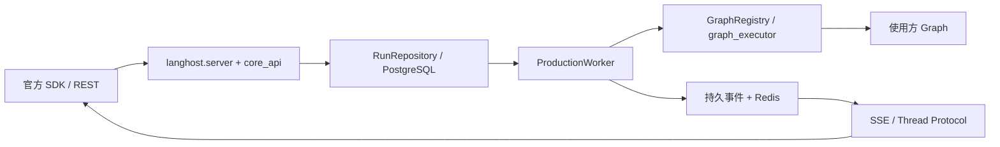

# GraphHarbor：Agent Server 能力、业务边界与 API 兼容性调研

调研日期：2026-09-24；同日补充 checkpoint 修剪与回滚修复结果。性质：技术调研、整改进度与证据索引，不是全量验收报告。

更新日期：2026-09-25。业务边界实施现状见第 7 节，Thread 输入校验与 OpenAPI 比较器进展见第 13 节；第 5、8、11 节中的 500、零差异和 10 passed 是最初调研证据，不再代表当前实现。未标注整改结果的能力表和源码描述仍是 9 月 24 日的调研快照。

## 1. 结论

**GraphHarbor 已有独立 Agent Server 的主要运行骨架，但没有完整实现官方 Agent Server，也还不能声明“与 langgraph-api 功能和接口完全相同”。**

三个问题的直接回答：

1. **是否都实现了？没有。** Assistants、Threads、Runs、状态持久化、队列、SSE、HITL、Store REST 等已有实现；资源级授权已接入候选生产链路，但全入口兼容验收仍缺。完整 OpenAPI schema、并发策略、生产 cron 调度、生产 webhook、Store 自动注入、部分配置和协议能力仍有实质缺口。
2. **业务边界解耦完成了吗？代码迁移已落地，整体验收未完成。** 核心 worker 不再解释 `model_id`/`platform_trace_id`，固定 tenant/project 身份与 SQL scope 已从当前模型和生产路径移除，DeepAgent workspace 已移出核心源码与候选包；业务授权、模型/trace 和 workspace 由平台负责。官方全入口 Auth 差分、业务 run/HITL、文件正向链路和维护切换仍缺证据，因此专项状态为 `partial`，不能宣称已完成或可上线，详见第 7 节。
3. **怎么保证接口一样？** 固定官方版本，以官方 OpenAPI、同图双服务行为差分、官方 SDK/RemoteGraph、授权与故障场景组成持续门禁。比较器已从路径/方法扩展到部分结构契约比较，但完整规范与运行行为仍未对齐（见第 13 节）。

**同日整改进度：** 第 6.2、6.3 节的 prune 授权范围与 rollback 历史误删问题已完成核心修复，并通过真实 PostgreSQL 专项和相关回归。治理项目仍为 `partial`：完整官方差分、规模性能和发布预演尚缺；不能据此升级为全量兼容。详见[修复项目](projects/20260924-checkpoint-mutation-safety/README.md)。

建议定位：**业务无关、与指定版本 LangGraph Agent Server 公共契约兼容的自托管运行时。** 不应笼统承诺兼容永远变化的“最新版”。

## 2. 调研范围和证据强度

本轮查阅了 LangChain 官方文档 MCP、官方 Agent Server OpenAPI、仓库当前源码、CLI 实际入口、兼容比较脚本、CI 和历史验收产物，并执行了无数据库探测与比较器测试。

| 项目 | 本次观察 |
| --- | --- |
| HEAD | `d9bcf664c3aad60b62f606cb8e2e25e795d5ed96` |
| 工作树 | 有既存修改及未跟踪的 v3 代码/产物；本报告审查的是当前工作树，不是纯 HEAD |
| 两个包的源码声明 | `0.13.0.post32` |
| 本地已安装包元数据 | graphharbor / graphharbor-runtime 均为 `0.13.0.post30` |
| 实际 Python 导入 | 已核实指向本工作区源码；本轮探测反映当前源码 |
| 官方比较版本 | `langgraph-api==0.13.0` |
| 配套版本 | LangGraph `1.2.11`、Python SDK `0.4.3`、CLI `0.4.31`、inmem `0.33.0` |
| 官方包内 OpenAPI SHA-256 | `0b4d3d1e2da065a50a53838e7f63f5d90763a1dc759b165dd7a4409b5959888c` |

证据分级：

- **实测**：本轮执行产生的结果。
- **源码确认**：实际生产调用链或分支明确可见，未必完成实时双端验收。
- **历史证据**：仓库已有测试和产物，本轮没有重新证明其全部结论。
- **待验证**：没有足够证据证明等价，不等同于已经确定完全不可用。

初始调研阶段没有修改运行时代码或数据库。后续经用户授权，已实施第 6.2、6.3 节修复，在独立可丢弃 PostgreSQL 数据库和隔离 Redis 前缀执行测试，并启动临时官方 dev 服务作基础对照。未操作生产数据、未调用真实模型、未发布；本报告不把局部数据库回归称为全量验收。表内 HEAD 为初始调研基线，修复以对应提交及项目验证记录为准。

## 3. 先明确：langgraph dev、Agent Server、LangSmith 平台是不同层次

官方文档将 `langgraph dev` 定义为 Agent Server 的轻量开发运行方式：无需 Docker、热重载、调试器支持、状态保存到本地目录；不是生产 PostgreSQL 部署方式的别名。官方说明开发服务与生产服务使用同一套集成测试验证行为。

当前 GraphHarbor 默认走 PostgreSQL + Redis，API 与 worker 分开启动。这种内部架构不违反 Agent Server 边界，但**尚不等于已经复刻 langgraph dev 的启动体验**。

建议分别验收：

| 目标 | 应承诺的内容 |
| --- | --- |
| Agent Server API 兼容 | 请求、响应、状态机、流、授权钩子和 SDK 行为一致 |
| 图应用兼容 | 标准 graph 导出、factory、langgraph.json、auth、custom app 可运行 |
| dev 体验兼容 | 一条命令启动、图代码重载、调试、清晰的本地存储方式 |
| 生产可靠性 | 持久化、恢复、并发、租约、取消、跨实例流、运维能力 |

LangSmith 的组织管理、计费、部署控制平面、实验评估、托管 UI 不必由 GraphHarbor 重造。Studio 是客户端集成对象。LangSmith tracing、反馈等若出现在目标 Server 契约中，应逐项说明支持范围，不能用“与业务无关”作为跳过通用协议功能的理由。

## 4. 官方 Agent Server 的能力与当前实现

以下“已有”表示存在生产实现或已有历史证据，**不表示该资源族所有字段和边界条件已经兼容**。

| 能力 | 官方含义 | GraphHarbor 状态 | 主要证据/缺口 |
| --- | --- | --- | --- |
| 图注册、发现 | 加载 compiled graph/factory，自动创建默认 assistant | 已有，部分兼容 | `graph_registry.py`、默认 assistant 注册；Python 文件加载为主 |
| Assistant 管理 | 创建、查找、计数、修改、删除、版本、latest、图、schema、子图 | 已有 | `core_api.py` 各 handler；仍需字段级/错误级差分 |
| Thread 管理 | CRUD、搜索、计数、复制、prune、预置 supersteps、TTL | 部分 | CRUD/copy/prune 有；create 没有处理 `ttl`、`supersteps` |
| 状态与历史 | 读取/更新 state、checkpoint 定位、history、time travel | 部分 | 基础已有；结构化 checkpoint/namespace 参数贯通不完整 |
| Thread Runs | 后台、等待、流式、读取、列表、join、取消、删除 | 已有，部分兼容 | 生产 API/worker 闭环存在；参数和取消语义仍有差异 |
| Stateless Runs | 无会话持久状态的调用、wait、stream、batch | 已有入口，待补语义验收 | root routes 存在；与默认注入 checkpointer 的组合需验证 |
| 四种并发策略 | enqueue、reject、interrupt、rollback | 部分 | repository 只显式处理 reject；interrupt/rollback 提交策略未见执行分支 |
| 延迟运行 | `after_seconds` 延迟启动 | 生产缺口 | 旧 `ops.py` 有逻辑，生产 `RunRepository.create/claim_next` 未使用该字段 |
| HITL | interrupt、可寻址的 resume、重启后恢复 | 已有，部分已验证 | command 转换、持久中断、protocol resume；不是业务审批规则 |
| Legacy Run SSE | values/messages/updates/custom 等、子图、断线重连 | 已有，部分兼容 | durable event + Redis fanout；`on_disconnect` 行为未接入当前 SSE finally |
| Thread streaming protocol | commands、SSE、WebSocket、订阅、状态查询等 | 部分 | commands 当前仅 `run.start`、`input.respond`；没有 WebSocketRoute |
| 原生 LangGraph v3 | 图内 typed stream、lifecycle、message/tool/subgraph projections | 使用原生能力，但远程协议有差异 | 当前 executor 使用 `astream_events(version="v3")`；历史严格差分有 26 项 |
| Cron | 管理定时任务、按时触发、时区、结束时间、完成后清理 | 管理 API 有，默认生产调度未接通 | `cron_create/update` 保存记录；默认 API lifespan/worker 未启动 cron scheduler |
| Webhook | run 结束后的通用回调 | 默认生产缺口 | CLI 接收配置；真正分发位于依赖 `langgraph_api` 的旧 queue 层 |
| Store REST | namespace/key CRUD、filter/search、namespace 列表 | 已有 | `store_api.py` + `AsyncPostgresStore` |
| 图内 Store 注入 | Server 自动注入 deployment Store | 缺口 | registry 只自动 attach checkpointer，没有对应 Store 注入 |
| Store 语义检索 | 配置 embeddings/index，返回相关性结果 | 未完整接通 | `_STORE_CONFIG` 被保存但 setup 不消费；构造 Store 未传 index |
| Store/Thread TTL | 默认 TTL、逐资源 TTL、refresh/sweep | 部分字段/依赖能力，闭环不足 | REST 接受部分 Store TTL；未见生产 TTL 配置接入和启动 sweeper |
| MCP Server | 将图暴露为 MCP tools，协议与 schema 正确 | 有基础实现，未证明官方等价 | FastMCP Streamable HTTP；统一 `input: dict`，直接调用 graph |
| A2A | 官方 agent-to-agent 服务契约 | 缺失 | 无 `/a2a/{assistant_id}` route，排除表明确排除 |
| 自定义认证 | `Auth.authenticate`，用户上下文 | 已有部分 | 支持 `_authenticate_handler` 和 callable，保留部分 user 数据 |
| 资源级授权 | `@auth.on.*` 事件、过滤器、Store namespace 改写 | 候选实现已接入，待全入口差分 | 9 月 24 日未发现生产 handler 分发；9 月 25 日已接入通用 Auth，Thread 拒绝路径通过，官方事件/过滤器/Store 差分未完成，见第 6.1、7 节 |
| Custom routes/lifespan/CORS | 用户应用扩展 | 已有部分 | app mount、lifespan、CORS 有；路由冲突优先级、middleware、mount prefix 等需逐项核对 |
| 定制 Store/Checkpointer | 官方配置加载自定义后端 | 缺口 | CLI 接收配置，但生产 factory 固定 PostgreSQL 实现 |
| JS/TS 图运行 | 运行 LangGraphJS 图 | 明确不支持 | CLI 检测 `node_version` 后报错；JS SDK 支持不代表 JS graph 支持 |
| RemoteGraph/Studio | 无私有适配的生态客户端 | 部分证据，不足以完整承诺 | 已有 Python/JS SDK 测试；本轮未运行完整 RemoteGraph/Studio 验收 |
| 开发热重载/多 API 进程 | 正确启动与重建应用 | 存在启动设计风险 | `uvicorn.run(app, reload=..., workers=...)` 传实例，不是 import string/factory |
| 健康/指标/恢复 | readiness、metrics、持久队列、恢复 | 有较多实现与历史证据 | readiness 的 queue 检查目前来自 Redis ready，不能证明 worker 正在消费 |

这里最容易产生误判的情况是：**旧兼容层里有实现，但默认生产启动链路没有调用。** 检索命中 `ops.py` 或 `queue.py` 不能直接记为“生产支持”。

实际默认执行主线：



## 5. API 表面核对：路径接近，不等于契约完整

### 5.1 固定版本与在线文档必须分别统计

本轮直接解析本机 `langgraph-api==0.13.0` 安装包携带的 `openapi.json`，再与当前 `_openapi_document()` 比较：

| 指标 | 官方 0.13.0 包内规范 | GraphHarbor 当前声明 |
| --- | --- | --- |
| paths | 49 | 51 |
| HTTP operations | 63 | 68 |
| 官方 operation 在本地声明中缺失 | — | 1：`POST /a2a/{assistant_id}` |
| GraphHarbor 额外 operation | — | 6 |
| 完全空白的 operation 对象 | — | 62 / 68 |
| components schemas | 有 | 无 |

额外六项：`GET /assistants`、`GET /threads`、`PATCH /threads/{thread_id}/state`、`GET /live`、`GET /ready`、`GET /runs/{run_id}/stream`。

在线官方文档 MCP 的 OpenAPI 本轮是 **50 paths / 64 operations**，比本机固定版本额外出现 `GET /threads/{thread_id}/storage`；GraphHarbor 当前没有这个路径。这属于**在线目标与锁定目标发生漂移**，不能混为同一版本的通过率。

本地规范的 62 个空操作没有 requestBody、参数、响应模型等关键内容；带路径变量的操作也没有完整参数定义。因此，这不是仅仅“文档描述少一点”，而是无法作为完整机器可验证契约。`/docs` 能打开不能证明 schema 兼容。

### 5.2 本次发现的具体契约问题

| 问题 | 当前行为/证据 | 影响 |
| --- | --- | --- |
| 输入校验不完整 | 实测 `POST /threads` 提交非法 UUID、JSON 数组、数字 metadata 均返回 500 | 应依据官方规范/实机返回可预期客户端错误，而非内部错误 |
| 后台 run 创建状态码/头 | 当前返回 201；固定版本规范声明 200 与 Content-Location | 规范与实现已有差异，须对官方实机核实并固化，不能只测 SDK 接受了结果 |
| checkpoint 形状 | 官方 RunCreateStateful 有 `checkpoint` 对象；当前核心逻辑主要读取 `checkpoint_id` | SDK 发送标准 checkpoint 对象时可能无法按指定历史状态执行 |
| 状态 checkpoint namespace | `_checkpoint_config()` 主要重建 thread_id/checkpoint_id | 需要覆盖嵌套 checkpoint_ns/map，不可只验主图 |
| Thread 预置/TTL | 官方 ThreadCreate 有 `supersteps`、`ttl`；本地未处理 | 请求可能成功但语义没有生效 |
| 未知并发策略 | repository 不校验完整枚举，只对 reject 分支处理 | 可能把非法值或 interrupt/rollback 当普通排队 |
| protocol 命令集 | 仅处理 run.start/input.respond | 官方文档中的 `agent.getTree` 等不受支持 |
| v3 混淆 | 官方 Run SSE `version=v3` 的历史采样仍为 legacy；本地增加 typed 输出 | 图内 v3、Thread Protocol v2、Run SSE 必须分开定义，不可共用“支持 v3”结论 |
| MCP 工具 schema | 所有 graph 暴露统一 input 字典签名，API 进程直接 ainvoke | 不等价于自动获得官方 schema、授权、run 生命周期和队列语义 |
| 能力信息 | 实测 `/info.flags.crons=true`，默认生产 scheduler 未接通 | API 宣传与实际执行能力不一致 |

有关 run 创建状态码：本轮引用的是固定包的静态规范，并未启动官方服务重做该请求。因此报告记录为“规范差异，需实机裁决”，不擅自覆盖历史真实行为证据。

## 6. 应优先处理的正确性与隔离问题

### 6.1 authenticate 不等于 authorize

`PrincipalMiddleware` 调用认证回调后，资源访问依赖 `tenant_id/project_id`。没有发现生产链路对官方 `@auth.on.threads.*`、`@auth.on.assistants.*`、`@auth.on.store.*` 等回调的分发。

本轮直接调用 Principal 转换验证：

```text
auth user {identity: alice} -> tenant/project 均为 __default
auth user {identity: bob}   -> tenant/project 均为 __default
两个 scope 相等；in_principal_scope 判断另一用户的同 scope 资源为 True
```

仅有不同 identity **并不意味着官方默认应自动做 owner 隔离**；关键问题是：使用方如果已经通过官方 `@auth.on.*` 配置 owner 限制，GraphHarbor 没有执行这些规则，固定 scope 无法代替它。应测试“authenticate 成功、authorize 拒绝”以及相同租户内不同 owner 的场景。

整改必须保留现有隔离保障，先接通通用授权机制、迁移现有使用方，再考虑移除固定平台字段；不能直接删除过滤条件。

**2026-09-25 更新：** 上述 `PrincipalMiddleware` 与固定 scope 的观察是初始状态。当前生产路由已接入通用 Auth 授权，平台通过 runtime-service Auth 和平台 ACL 回查执行项目及 Thread 规则；固定 tenant/project SQL scope 已从候选实现移除。已验证私有/共享/接管/撤权等 Thread 路径，但官方全入口授权事件与拒绝副作用差分未完成，不能将局部验证写成完整授权兼容。

### 6.2 prune 的 keep_latest 授权范围：核心修复已完成

原实现查询授权 rows 后，却将客户端原始 thread_ids 传入 saver；非法 strategy 也会进入 keep_latest 分支。锁定的 checkpoint-postgres 3.1.2 的 `aprune` 是未实现 stub，因此初始发现是源码风险，不是默认后端已发生越权删除的实测结论。

当前 `core_api.py::threads_prune` 校验请求、UUID 和策略，去重并锁定授权 rows，只对这些资源调用共享维护函数。旧 `ops.py::Threads.prune` 同样先执行删除授权事件。运行中或待回滚的 thread 返回 409，不与 checkpoint 写入并发维护。

PostgreSQL keep_latest 已实现：保留各 namespace 最新 checkpoint、pending writes 和 DeltaChannel 必需祖先；共享 blobs 保留。真实 HTTP 认证链测试证明混合授权/未授权/重复/不存在 ID 不会改动其他租户历史；子图、DeltaChannel 继续执行和 HITL resume 均有通过证据。此修复没有补齐全资源 `@auth.on.*`，第 6.1 节缺口仍然成立。

### 6.3 rollback 历史范围：核心修复已完成

原 `_cancel_row(action="rollback")` 先删除 run，再通过 after_commit 删除整个 thread checkpoints。生产入口与旧 `server.py::_run_cancel` 的这条危险路径已移除，单次及批量取消复用同一恢复逻辑。

新实现首次 claim 前保存 checkpoints、writes 和 thread 投影基线；运行中回滚持久化意图，等待执行停止或租约过期，再在同一个 PostgreSQL 事务内恢复基线并删除目标 run。saver 写入验证 run 状态、worker owner、租约与重试代次，防止旧执行者迟到写入；失败保留数据与意图，可重试。旧数据无安全基线、维护导致基线失效或存在后继依赖时返回 409。

已验证 A 成功→B→回滚 B→继续 C，原始 checkpoints/writes 完全恢复；同时覆盖真实 worker 运行中取消、批量逆序恢复、失败原子性和独立新进程恢复。完整历史基线增加 claim I/O 与存储成本，共享/孤立 blobs 暂不回收，尚无生产规模性能证据。新增 `007_checkpoint_baselines` 迁移，API 和 worker 必须同步升级，不能混用不遵守写屏障的旧 worker。

### 6.4 官方对照差异与剩余验收

固定 `langgraph-api 0.13.0` + in-memory runtime `0.33.0` 临时实机观察：

| 场景 | 官方观察 | GraphHarbor 本次实现 |
| --- | --- | --- |
| 已完成 run rollback | 404，state 保持不变 | 有安全基线且无后继依赖时允许恢复，属于扩展 |
| keep_latest | 422，in-memory 不支持 | PostgreSQL 实现支持，属于后端扩展 |
| 延迟 pending rollback，wait=true | 200 `{}`，紧随 GET 仍为 200 | 本地 pending 删除后 GET 404；可见时序差异待进一步对照 |

这不是完整双端差分，不能宣称严格 API 等价。剩余验证包括 running/batch/repeated/auth/input 官方矩阵、大历史与并发压力、故障部署演练及负责人验收。项目状态为 **partial**，详见[实现记录](projects/20260924-checkpoint-mutation-safety/implementation/01-transactional-checkpoint-maintenance.md)和[验证记录](projects/20260924-checkpoint-mutation-safety/verification.md)。

## 7. 业务边界：原始发现与实施进度

判断标准不是字段名字里有没有 business，而是 **Server 是否解释了某个使用方特有的语义并替它作决定**。

| 原始位置 | 9 月 24 日发现的耦合 | 原建议 |
| --- | --- | --- |
| `production_worker.py` metadata/trace 构建 | 读取 `configurable.model_id`；读取/写入 `platform_trace_id` | 不再作为核心预定义字段；由 graph factory 或上层 tracing 接入，必要时走不透明 metadata |
| `observability.py` 默认 allowlist | `model_id`、`platform_trace_id`；额外识别 `tool_names` | 默认仅留通用运行标识；工具名可作为不透明图事件数据，不应特判业务配置字段 |
| `auth.py::Principal/from_claims/from_auth_user` | 固定 tenant/project、delegation/jti、角色/权限映射和平台 trace | 保留标准用户身份与通用认证授权扩展；平台 claims 解释交给使用方 auth |
| `auth.py` runtime context 签名与 worker 校验 | 强制 user/tenant/project/role 的约定 | worker 可信上下文/防伪造机制可以保留，载荷应通用；不能为解耦削弱签名/绑定/时效校验 |
| `core_api.py`、`store_api.py`、models | 固定 tenant/project 过滤与 Store namespace 前缀 | 租户隔离本身是通用需求；强制所有应用采用两级平台组织结构不是官方通用契约。应通过授权扩展落实，并有兼容迁移 |
| `mcp_transport.py::_runtime_context` | 再次固定用户/租户/项目/角色/平台 trace | 与 REST/worker 采用一致的通用身份传递契约 |
| `graph_executor.py::thread_config` | `runtime_policy` 与 `__graphharbor_runtime_policy` 残留 | 生产主线未见实际调用，先查外部消费者，再弃用/迁移到使用方 |
| `deepagent_workspace.py` | deepagents filesystem backend、tenant/project/thread 路径、Skill 来源处理 | 移至使用方或测试辅助区，不放核心运行时发布包；从 `_MODULES` 去掉不等于从源码包移除 |
| `protocol.py::capability_document` | production auth 描述仍写 platform-api-delegation-jwt | 更新残留契约；当前 `/info` 走的是另一个函数，不应误认此字符串正在对外返回 |

以下应保留：

- 用户在 `input`、`metadata`、`config.configurable`、`context` 中传入业务数据；Server 将其存储、合并或传递不等于参与业务。
- 通用队列策略、租约、retry、timeout、durability、checkpoint、Store、认证和授权执行机制。
- HITL 的暂停/恢复；具体批准规则、预算、供应商、工具权限由 graph/auth/上层决定。
- 标准 LangGraph message/tool event 的转发；Server 不应据工具名选择业务处理分支。
- `tests/acceptance_app` 中的真实模型、业务示例、Deep Agents 图，前提是不进入核心默认行为和生产依赖。
- `business_error` 目前用于区分图应用错误与基础设施错误，不能仅凭名字就判定它是业务耦合，更不应为改名破坏错误协议。

本轮核心 Python 源码搜索未发现固定 miaomiao/deepseek 模型供应商路由；明确问题集中在字段解释、身份结构和专用辅助模块，不能夸大成“运行时已经硬编码所有模型业务”。

现有 `20260909-graphharbor-business-boundary-separation/FINAL_SUMMARY.md` 曾声称“移除所有业务耦合”，与 9 月 24 日源码及 20260923 open-issues 不一致。以下为后续整改进度，不能用旧总结代替当前验收。

### 2026-09-25 实施现状

| 边界问题 | 已落地且有证据的改动 | 尚未完成的验收 |
| --- | --- | --- |
| model / platform trace | 核心 worker 不再提取模型、项目或平台 trace 字段；默认 trace 只含通用运行标识，应用 `configurable` 同名字段可透传。平台 graph factory、模型引用和 Langfuse/OTel 继续解释业务数据；PG17 生产契约测试 65 passed、4 skipped，平台模型/工具/观测定向测试 58 passed | 正常/失败/cancel/retry/HITL/子图并发的业务 trace 联合关联、伪造字段与观测故障矩阵尚未完成；不以静态字符串搜索代替行为验证。见[模型与 trace 专题](projects/20260925-runtime-business-boundary-decoupling/02-model-and-tracing.md) |
| 固定 tenant/project 身份结构 | 核心 Principal 接受仅含 identity 的用户；执行身份改为绑定 run/thread 的通用 v2 签名快照。当前模型与查询不再持有固定 tenant/project scope，迁移 `008_remove_business_scope` 在隔离 PG17 对非空旧表拒绝、清理后升级及备份恢复已验证。本机两库旧运行数据已协调清理并迁移；平台保留业务身份、授权和 ACL。真实 HTTP 与治理浏览器用例覆盖 Thread 私有/共享/接管、服务账号 grant/token 撤销；官方 0.13.0 的 identity-only Auth/Thread/`runs/wait`/HITL/SSE 子集差分通过 | 官方全入口 Auth/API/SSE 差分、排队/HITL 完整业务执行、外部 Store 消费者盘点、本机归档完整恢复仍缺。见[身份授权专题](projects/20260925-runtime-business-boundary-decoupling/01-identity-and-authorization.md)与[迁移专题](projects/20260925-runtime-business-boundary-decoupling/04-data-migration-and-cutover.md) |
| DeepAgent workspace | `deepagent_workspace.py` 已从 GraphHarbor 源码、wheel 和 sdist 移除；平台继续使用自己的 `runtime_service.workspace.deepagent`，平台 workspace 定向测试 54 passed，候选包安装并加载三份平台配置各 65 条路由 | Showcase/DearFlow 浏览器文件创建、预览、下载和 zip、terminal、skills、fork/restart/HITL 恢复尚未联合验收。见[workspace 专题](projects/20260925-runtime-business-boundary-decoupling/03-workspace-and-packaging.md) |

**结论：三项指定耦合的核心代码迁移已完成，但“业务边界需求完成”尚不能判定为是。** 已跑的 GraphHarbor 隔离 PG17 全组为 149 passed、18 skipped，langhost 全组 58 passed；平台 ACL/gateway 定向 43 tests（3 skipped）、Runtime Auth 46 passed、治理浏览器 10 passed。官方 Auth 子集差分通过，但全入口、业务执行、文件正向链路和目标数据切换仍缺证据。平台旧 schema 的 Thread 500 已定位，现由启动检查明确拦截，现有数据库尚未迁移。项目状态仍为 [`partial`](projects/20260925-runtime-business-boundary-decoupling/README.md)。

**2026-09-25 本机切换更新：** 上段所述“现有数据库尚未迁移”是当时状态。本机 PG17 两库已停写、归档、清理旧运行历史并迁移；Runtime 现为 `008_remove_business_scope`，平台为 `20260925_0005`。清理前 57 Threads、324 Runs、434,742 条事件，约 7.7 GB Runtime 库几乎全部在 `runtime_events`；清理后 Runtime 11 MB、Thread/Run/Event 均为 0。归档目录已核对，完整恢复未演练；候选包 local stack 健康，但平台锁文件仍绑定旧 PyPI wheel，须以 `UV_NO_SYNC=1` 保持本机候选安装。专项仍为 `partial`，业务 run/HITL、文件正向链路和最终差分未完成。

**2026-09-25 优先级调整与实施进度：** 高频流事件逐条永久保存在 `runtime_events` 的容量问题另立[Runtime 流事件保留治理](projects/20260925-runtime-event-retention/README.md)。已实现 24 小时已结束 Run 原始事件保留、分批清理与三入口过期游标响应；隔离 PG17 的 10,000 条增量清理实测 0.398s，新增失败终态保留回归后四文件定向测试 100 passed、4 skipped。候选双 wheel 已在独立 Runtime/Platform PG17 库和端口通过 Thread 创建/读取、state/history、Graph 搜索及未登录拒绝；但官方错误 Run 的 `error` 帧与 GraphHarbor v2 存在既有映射差异，官方超窗/鉴权、撤权重连、平台 Web/业务 Run、稳定容量仍未完成，项目为 `partial`。业务边界专项暂缓后续实施，状态也为 `partial`；已完成证据、候选环境限制及恢复顺序见其[暂停点与恢复入口](projects/20260925-runtime-business-boundary-decoupling/README.md)。事件保留项目完成不自动使业务边界专项完成。

## 8. 现有兼容保障为什么不够

### 已有基础值得复用

- 固定 Python 依赖、版本映射及排除项。
- `compare_official_protocol.py` 双服务 REST/SSE 对照。
- Python SDK、JavaScript SDK 契约测试。
- fixture/能力映射、统一结果、四象限升级比较脚本。
- 持久化、取消、worker kill/restart、stream replay 等测试与历史产物。

### 当前门禁存在的盲区

1. **OpenAPI 只比较 paths/methods。** `compare()` 明确跳过 OpenAPI body；`_compare_openapi()` 不比较 schema。本轮改变 `requestBody.required` 后比较器仍返回空差异。
2. **测试还主动保护这个宽松行为。** `test_compare_openapi_uses_path_and_method_shape_only` 明确要求 operation 内容不同也通过。比较器测试本轮 `10 passed`，说明“比较器按现有设计工作”，不是“服务已经兼容”。
3. **通用 UUID 归一化擦除了身份关系。** 全部替换为 `<uuid>` 会掩盖 run/thread/assistant 关联错误；lifecycle 对比已有别名映射思路，可复用到其他场景。
4. **SSE 对照忽略 id。** 不同流序号可以相同通过，不能证明 cursor 连续性、重连或重复事件正确。
5. **场景广度不够。** 当前 `official-protocol-scenario.json` 只有 11 个步骤，主要是 assistant/thread 基础读写、Store、thread/run stream；不覆盖所有 cron、授权、错误、TTL、并发语义。
6. **升级对照是手动 workflow。** 常规 PR CI 有本地契约与 JS 测试，但真实官方双服务差分主要在 `workflow_dispatch` 升级工作流；无法保证日常修改不偏离官方。
7. **版本锁定检查不是行为证明。** `check_compatibility_baseline.py` 检查声明字符串与版本，甚至要求 status 字符串为 passed；没有据此重新执行全契约。
8. **旧产物不能证明当前源码。** `compatibility-result.json` 是 2026-08-31 的 9 项 passed；v3 lifecycle 另有 26 项差异。不能用旧“21/21”文档或单个 passed 文件覆盖它们。
9. **排除项已经有漂移。** 当前官方包内含 `/metrics`，排除表仍把它作为 GraphHarbor 独有项；state PATCH 实际挂载了，但排除说明仍说使用 POST。需重新核对。
10. **包、源码、文档状态不同步。** 当前 post32 源码、本地 post30 元数据和更早矩阵并存，报告必须绑定准确的代码与环境。

## 9. 如何保证“暴露功能和接口与 langgraph-api 一样”

### 9.1 先把“一样”写成可以失败的约束

目标不是要求两个 Server 内部代码相同，而是：

> 在指定官方版本、同一图、同一配置、同一调用序列和同等故障条件下，未修改的官方客户端看到等价的响应、授权结果、状态迁移、事件与可恢复性。

至少固定以下比较维度：

| 层次 | 必须比较 |
| --- | --- |
| HTTP 表面 | 路径、方法、query/header/body、required/default/enum/nullability、状态码、响应头 |
| JSON 契约 | request/response schema、字段类型、缺省/null、嵌套对象、错误 envelope |
| 状态语义 | assistant version、thread status/state/history、run 生命周期、checkpoint 归属 |
| 异步语义 | enqueue/reject/interrupt/rollback、取消确认、延迟运行、cron、webhook |
| 流语义 | 每种端点独立的 framing、事件类型/顺序、namespace、message/tool 标识、终态 |
| 重连语义 | cursor 合法性、边界、保留期、重复/缺失事件、since/Last-Event-ID |
| 授权 | 事件名、ctx/value、过滤/改写、调用顺序、拒绝路径、隐私隔离 |
| 集成 | Python sync/async SDK、JS SDK、RemoteGraph、Studio、MCP/A2A |
| 配置 | langgraph.json 中每个承诺支持的配置是否实际生效 |

“官方行为一致”和“仅客户端能解析”应分别记录。SDK 能容忍额外字段，不等于协议完全一致。

### 9.2 固定版本化基线，复用现有工具

优先以已经安装且已锁定的 `langgraph-api==0.13.0` 建立完整基线，同时将在线新能力记入升级差异。不要同时追两个含糊目标。

建议保存：官方包/镜像版本与摘要、CLI/LangGraph/SDK 版本、OpenAPI 快照与哈希、配置/fixture 哈希、GraphHarbor commit+dirty diff hash、结果时间与执行命令。

允许规范化无关差异，如文档描述、服务 URL、独立生成的时间和 ID；但 ID 应使用保持引用关系的别名映射，并单独验证时间格式/顺序。**不得规范化掉必填项、状态码、事件类型、授权结果和数据缺失。**

若官方规范与官方实机不同，登记独立“上游规范/实现不一致”记录，用官方 SDK 行为和稳定实机结果裁决目标；不能静默忽略。

### 9.3 建立从规范到真实 handler 的覆盖表

复用 `docs/acceptance-capability-map.json` 等已有映射，每个 operation 至少关联：

```text
operation + schema fields + config options
  → 实际挂载的 handler
  → 生产调用链
  → fixture 与官方对照 scenario
  → 必须满足的断言
  → 本次执行证据
```

完整 OpenAPI 应由一个权威模型/定义生成或校验，不继续人工维护空 `{}` 路由表。可重用官方公开规范作测试输入，但不能仅拷贝规范文件就声称已经实现；是否分发上游文件还应遵守其许可。

支持范围的最终目标按用户要求包含官方公共 Server 能力。阶段性可分批实现，但未完成项保留失败/未运行状态；不能靠不断扩大 exclusions 获得“全兼容”。GraphHarbor 自有运维扩展与官方契约分开记录。

### 9.4 同图双端差分是主要验收方法

继续使用现有 comparison runner，在官方与 GraphHarbor 各运行相同确定性 fixture。至少补齐：

| 场景组 | 最小有效断言 |
| --- | --- |
| 全资源 CRUD | 默认值、分页/排序/filter、重复、404/409、非法 UUID/JSON、null 与缺省 |
| 状态/历史 | 不同节点、子图、指定 checkpoint、history before/filter、supersteps、copy |
| 并发 | 四种策略；两个 API 同时提交；同 thread 串行、不同 thread 并行 |
| 取消/rollback | pending/running/terminal；取消等待；历史 checkpoint 不误删；取消后无迟到写入 |
| HITL | 单个/多个 interrupt、逐 ID 恢复、重复响应、断线/重启后恢复 |
| 流 | 所有承诺 mode；legacy Run SSE、thread stream、Thread Protocol、WS 分别验 |
| Store | REST 和图内访问同一 Store；namespace auth、filter、query/index、TTL |
| Cron | 到时确实生成 run；禁用/到期停止；时区；多 worker 不重复；完成后清理 |
| Webhook | 终态确实送达；payload/auth/重试与目标一致；按目标版本验证 URL 安全策略 |
| Auth | authenticate 成功但 authorize 拒绝；owner 过滤；assistant 授权；Store namespace 改写 |
| 配置 | 声明配置后观察实际效果；未支持配置不得静默吞掉 |
| 扩展客户端 | 未改官方 SDK/RemoteGraph；MCP discovery/call；A2A；Studio 操作烟测 |
| 故障恢复 | API/worker/Redis 重启、PG 暂时失败、慢消费者、跨主机断流 |

真实模型只做单独端到端烟测。协议基线用确定性消息/tool chunks，不比较自然语言，不把模型波动当 Server 回归。

### 9.5 CI 与发布门禁

| 入口 | 必须执行 | 失败处理 |
| --- | --- | --- |
| 每个 PR | schema/route/配置映射检查、输入边界、auth/隔离、确定性双服务核心场景、SDK | 失败阻止合并；是否已经开启分支保护本轮未查远端 |
| 定期完整任务 | 全 operation/参数场景、WS/MCP/A2A、故障与重连、Store/cron 时间行为 | 生成缺口，不能更新为全量通过 |
| 依赖升级 | 旧官方/新官方/旧本地/新本地四象限差分；检查实际安装版本而非只填 workflow 输入 | 区分上游变化与本地回归 |
| 发布前 | 在隔离环境安装真实 wheel，跑同一门禁；确认无意外私有 langgraph_api 依赖 | 未跑、阻塞、失败都不能作为通过 |

现有 `passed/failed/blocked_external_dependency/not_run/informational` 状态可以继续使用，不另造结果系统。结果同时记录 operation/字段覆盖，不能只有一个 capability 大标签。

**可对外声明完全兼容的条件：** 目标版本全部必需 operation、配置与协议场景有本次通过证据；未解释的 schema/行为差异为零；无用排除项遮蔽官方功能；包产物与验收版本一致。有限测试不能数学上证明所有输入永远一致，但这套机制可以给出明确范围、可复现证据和持续回归保障。

## 10. 建议整改顺序与验收出口

| 优先级 | 工作 | 完成的判据 |
| --- | --- | --- |
| P0 | prune/rollback 核心修复已落地；继续补全资源授权、请求边界及剩余验收 | 拒绝授权确实生效；跨 owner/tenant 数据不变；非法请求不变成 500；历史不误删 |
| P0 | 修兼容门禁与 OpenAPI | 删除/改动一个 schema 必填项会失败；规范与真实路由互相校验；日常 CI 跑固定官方对照 |
| P1 | 补 Runs 参数与状态语义 | checkpoint 对象、四策略、延迟、取消/断开等同图双端通过 |
| P1 | 接通生产 cron/webhook/Store | 真正触发与送达；图内 Store 自动可用；TTL/index 配置生效 |
| P1 | 完成业务字段与身份解耦 | 最小 identity auth + 通用 hooks 可用；核心不解释 model/platform policy；既有使用方有迁移验收 |
| P2 | 补完整协议与扩展 | WebSocket、commands 全集、MCP schema/行为、A2A、RemoteGraph/Studio 通过 |
| P2 | 完善 dev/配置兼容 | 热重载/调试/进程启动可靠；单命令工作流；Python import/factory/config 范围完整 |
| P2 | 若承诺跨语言图部署，补 JS runtime | 用真实 LangGraphJS 图运行验收，不能以 JS 客户端测试代替 |
| P3 | 同步能力声明与历史文档 | 报告、矩阵、/info、安装产物和实际行为一致 |

这些是推进顺序，不是把 P2 能力永久排除在“完全兼容”之外。无需推翻 PostgreSQL/Redis 架构，也无需为每个缺口新建框架；优先沿现有 API/registry/repository/worker 和比较脚本修正。

## 11. 本轮验证记录与后续复现入口

| 验证 | 结果 | 说明 |
| --- | --- | --- |
| 官方文档与 OpenAPI 查询 | 完成 | 官方在线与固定版本分开记录 |
| 固定官方规范 vs 本地声明统计 | 完成 | 49/63 vs 51/68，缺 A2A，62 空操作 |
| 实际源码导入路径 | 确认 | 使用 editable 工作树源码 |
| 无 DB ASGI 非法请求探测 | 发现 3 类 500 | UUID、数组 body、数字 metadata |
| Principal 默认 scope 探测 | 确认不同 identity 同 scope | 说明固定 scope 不能替代使用方 owner 授权 |
| schema 变化探测 | 比较器返回零差异 | 明确现有门禁盲区 |
| 比较器现有测试 | `10 passed in 0.33s` | 不等价于 Server 全能力验收 |
| 修复相关数据库/生产/REST/官方 SDK 回归 | `85 passed, 4 skipped` | skip 为已迁业务层旧测试，不算通过 |
| 后续增强：专项及 persistence | `14 passed` | 独立新进程恢复、006→007→006→007 迁移往返 |
| 最终数据库时钟改动后专项 | `10 passed` | 与上述批次重叠，不累加 |
| Ruff、相关 7 文件 mypy、diff check | 通过 | 详见项目验证记录 |
| 官方固定版本临时 dev 探针 | 完成基础场景 | terminal/prune/pending 差异见第 6.4 节 |
| 全量兼容/生产规模性能/真实模型 | 未运行 | 不将专项验证当作全量通过 |

可复现的现有测试命令：

```bash
.venv/bin/python -m pytest libs/langhost/tests/test_official_protocol_compare.py -q
```

无数据库的非法请求探测：

```python
import asyncio
import httpx
from langhost.server import create_app

async def main():
    app = create_app({"graphs": {}, "http": {"disable_mcp": True}})
    transport = httpx.ASGITransport(app=app, raise_app_exceptions=False)
    async with httpx.AsyncClient(transport=transport, base_url="http://probe") as client:
        for body in [{"thread_id": "not-a-uuid"}, [], {"metadata": 3}]:
            response = await client.post("/threads", json=body)
            print(body, response.status_code)

asyncio.run(main())
```

此探测未启动 lifespan，不接数据库；这些非法输入在访问数据库前失败。应在未设置 production auth 限制的隔离开发进程运行。修复后应与固定官方服务对照预期 4xx，而不是将当前 500 写成长期正确断言。

## 12. 证据索引

### 官方资料（2026-09-24 经官方文档 MCP 查阅）

- [Agent Server 概览](https://docs.langchain.com/langsmith/agent-server-overview)
- [Agent Server 架构、持久化与队列](https://docs.langchain.com/langsmith/agent-server)
- [Agent Server API Reference](https://docs.langchain.com/langsmith/server-api-ref)
- [CLI：dev](https://docs.langchain.com/langsmith/cli#dev)
- [Local development & testing](https://docs.langchain.com/langsmith/local-dev-testing)
- [认证与资源授权](https://docs.langchain.com/langsmith/auth)
- [四种并发策略](https://docs.langchain.com/langsmith/double-texting)
- [Cron jobs](https://docs.langchain.com/langsmith/cron-jobs)
- [Webhooks](https://docs.langchain.com/langsmith/use-webhooks)
- [TTL](https://docs.langchain.com/langsmith/configure-ttl)
- [语义搜索](https://docs.langchain.com/langsmith/semantic-search)
- [Thread Protocol command / WebSocket 说明](https://docs.langchain.com/langsmith/agent-server-api/streaming/protocol-v2-command)
- 在线规范：官方 MCP 文档文件 `/openapi/langsmith/agent-server-openapi.json`。
- 固定规范：本机 `langgraph-api==0.13.0` distribution 提供的 `site-packages/openapi.json`，哈希见第 2 节。其 `info.version=0.1.0` 是规范信息，不应误当 Server 包版本。

### 仓库源码与证据

- [server.py：OpenAPI、路由、create_app、run_server](../libs/langhost/src/langhost/server.py)
- [core_api.py：资源 handler、prune、run、cancel、cron](../libs/langhost/src/langhost/core_api.py)
- [protocol_api.py：command 分发和 SSE](../libs/langhost/src/langhost/protocol_api.py)
- [streaming.py：Run/Thread SSE](../libs/langhost/src/langhost/streaming.py)
- [cli.py：配置转交、JS 限制、worker 分支](../libs/langhost/src/langhost/cli.py)
- [auth.py：通用 Principal、v2 签名上下文、认证](../libs/langgraph-runtime-pg/src/langgraph_runtime_pg/auth.py)
- [production.py：生产 lifespan](../libs/langgraph-runtime-pg/src/langgraph_runtime_pg/production.py)
- [production_worker.py：实际 worker](../libs/langgraph-runtime-pg/src/langgraph_runtime_pg/production_worker.py)
- [run_store.py：提交与 claim](../libs/langgraph-runtime-pg/src/langgraph_runtime_pg/run_store.py)
- [graph_registry.py：图加载与 checkpointer 注入](../libs/langgraph-runtime-pg/src/langgraph_runtime_pg/graph_registry.py)
- [graph_executor.py：原生执行和上下文](../libs/langgraph-runtime-pg/src/langgraph_runtime_pg/graph_executor.py)
- [store.py：生产 Store 初始化](../libs/langgraph-runtime-pg/src/langgraph_runtime_pg/store.py)
- [observability.py：默认 trace keys](../libs/langgraph-runtime-pg/src/langgraph_runtime_pg/observability.py)
- [Workspace 移除与平台承接记录](projects/20260925-runtime-business-boundary-decoupling/03-workspace-and-packaging.md)
- [MCP transport](../libs/langhost/src/langhost/mcp_transport.py)
- [官方比较器](../scripts/compare_official_protocol.py)与[对应测试](../libs/langhost/tests/test_official_protocol_compare.py)
- [常规 CI](../.github/workflows/ci.yml)与[手动兼容升级流程](../.github/workflows/compatibility-upgrade.yml)
- [现有排除项](compatibility-exclusions.json)、[兼容矩阵](compatibility-matrix.md)
- [历史统一结果](../artifacts/compatibility-result.json)、[26 项 lifecycle 差异](../artifacts/v3-lifecycle-diff.json)
- [边界分离旧总结](projects/20260909-graphharbor-business-boundary-separation/FINAL_SUMMARY.md)、[worker 存量业务字段记录](projects/20260923-worker-concurrency-event-flush/open-issues.md)


## 13. 2026-09-25 整改进展：Thread 输入边界与 OpenAPI 差异检测

对应项目：[Agent Server 契约验证与兼容门禁](projects/20260925-agent-server-contract-validation/README.md)。总体状态 **partial**，不是完整兼容验收通过。

### 已落地改动

| 范围 | 当前实现与证据 | 结论边界 |
| --- | --- | --- |
| Thread 创建输入 | `threads_create()` 先解析、验证再连接数据库；三类原始问题（非法 UUID、数组 body、数字 metadata）均返回 422；malformed JSON 返回 400 | 已消除这三类无数据库 500；不是所有 endpoint 输入校验完成 |
| 附加输入约束 | 校验 config/metadata 类型、if_exists 枚举、ttl 类型/strategy/数值、supersteps 的 updates 数组 | 仅基础校验；null、嵌套 update、TTL 执行与 supersteps 状态初始化仍需完整对齐 |
| 官方实机对照 | 在 `tests/javascript/fixtures` 启动 `langgraph dev`，固定 `langgraph-api==0.13.0`；三类非法请求均为 422、application/json、字符串 detail | 已核对 status、媒体类型和 envelope；detail 文本不相同，未完成逐字错误响应兼容；malformed JSON 的官方行为本轮未对照 |
| OpenAPI 比较器 | `_compare_openapi()` 递归比较 operation parameters/requestBody/responses/security、path 级 parameters 和 components.schemas；覆盖 required、类型、format、响应状态和 `$ref` 的差异测试 | `$ref` 字符串被比较，但不是完整引用解析；compare() 的 OpenAPI body 仍由 CLI 单独调用此函数比较 |
| 本地 OpenAPI | `/threads` POST 增加必需请求体、200/409/422 响应及 ThreadCreate/Thread/ErrorResponse 组件 | 仍是部分 schema，其他大量 operation 为空；复制或声明 schema 不等于运行时能力实现 |
| CI | production-contract 加入比较器测试；固定官方规范 SHA-256，缺失或漂移会导致测试失败 | 日常 CI 是比较器回归检查，不是全量官方契约一致性门禁；完整差分仍由 Compatibility Upgrade 执行 |

### 当前验证结果

- `uv run pytest libs/langhost/tests/test_cli.py libs/langhost/tests/test_official_protocol_compare.py -q`：23 passed。
- 本次涉及 Python 文件的 Ruff check 与 format check 通过；`uv run mypy`：37 个源文件通过。
- 官方规范 hash：`0b4d3d1e2da065a50a53838e7f63f5d90763a1dc759b165dd7a4409b5959888c`，由安装包 `openapi.json` 校验。
- 最终工作树重新统计：**未应用排除项 203 处结构差异；应用 docs/compatibility-exclusions.json 的 path/method 排除项后 194 处**。此前 235 处是中间版本统计，已被本次数值替代。差异数量是比较器输出项数，不是缺失接口数量或兼容率。
- 上述 pytest 包含“当前官方规范应检出差异”的回归断言。因此测试通过证明检测器工作，不能表述为这 194 处差异已通过验收。

### 剩余工作与验收出口

1. 补齐真实 handler 对应的 OpenAPI operation、参数、请求和响应模型；逐项处理当前差异，不能靠整份复制官方 JSON 或扩大 exclusions 清零。
2. 输入验证还需覆盖合法创建路径、显式 null、嵌套 updates 及其它创建入口；错误文案和未对照的状态码需要固定版本官方实机证据。
3. 比较器还需覆盖 components 中的共享 parameters/responses/securitySchemes、顶层 security、path `$ref` 等；当前 prose 归一化只特别保护 properties 映射，仍须核查其它命名映射和 default/const 等数据对象，避免误删同名业务数据键。
4. 现有固定规范回归锁定了上游 hash，但不阻断任意新增本地差异。真正的日常严格兼容门禁仍需比较完整目标契约并对差异返回非零；在此之前保持 partial，不能用单测绿灯升级兼容矩阵。

本次改动没有引入业务模型、供应商、工具或 trace 字段，也未改变第 6 节已完成的 prune/rollback 修复结论。
