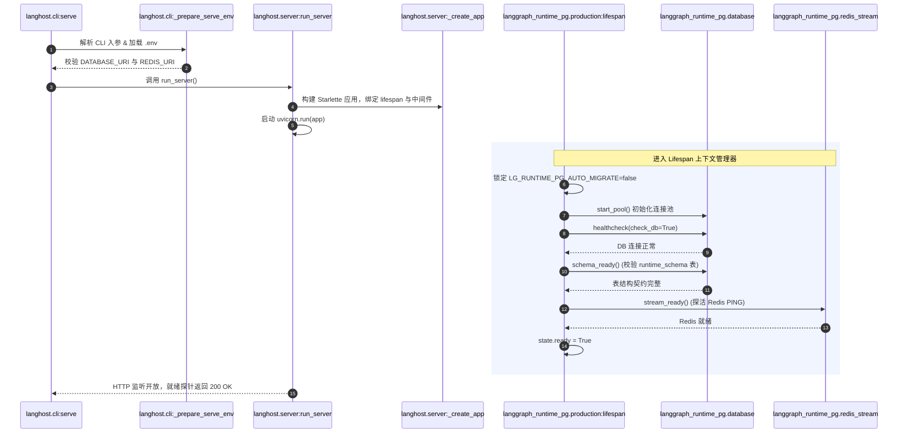

# 01-系统全貌、双包物理边界与启动生命周期

> **模块定位与核心价值**：本模块作为 GraphHarbor 的中枢神经与架构骨架，统揽整个 Monorepo 的双包物理拆分原则、CLI 命令分发路由以及多进程服务启动生命周期（Lifespan）。它解决了自托管 Agent 运行时在工程化演进中常见的“依赖泥潭”、“版本漂移”以及“启动时并发迁移死锁”等致命生产隐患。

---

## 零、知识前置与上下文串联（Knowledge Bridges）

### 1. 认知输入（前置输入契约）
- **CLI 命令行参数与 Flags**：`graphharbor serve --config ... --database-uri ... --redis-uri ... --workers 4`
- **环境变量注入**：`DATABASE_URI` (PostgreSQL asyncpg/psycopg 连接串)、`REDIS_URI` (Redis 任务总线串)、`LG_RUNTIME_PG_AUTO_MIGRATE=false`
- **声明式配置清单**：遵循 LangGraph 官方标准的 [langgraph.json](file:///Users/lijiaxin/PyCharmMiscProject/graphharbor/langgraph.json)（包含 `graphs` 定义、`env`、`dependencies`、`store` 等）。

### 2. 本章核心流转
- **参数校验与环境预热**：[`langhost.cli`](file:///Users/lijiaxin/PyCharmMiscProject/graphharbor/libs/langhost/src/langhost/cli.py) 校验入参互斥性（例如 `--reload` 严禁与 `--workers > 1` 混用），加载 `.env`，动态向 `sys.path` 注入图项目根目录与自定义依赖目录。
- **运行时就绪探针（RuntimeReadiness）**：[`langgraph_runtime_pg.production.lifespan`](file:///Users/lijiaxin/PyCharmMiscProject/graphharbor/libs/langgraph-runtime-pg/src/langgraph_runtime_pg/production.py) 按严格逆序编排持久化资源——先启动 asyncpg/SQLAlchemy 连接池，执行底层健康检查与表结构契约检测（`schema_ready`），再探活 Redis Streams。
- **服务分发与监听**：通过 Starlette 构建 ASGI 网关并启动 Uvicorn；或通过 `graphharbor worker` 直接启动独立队列消费进程。

<details>
<summary>💡 <b>老王 30 秒原地折叠小拐杖：双发布包与锁步发版 (Lockstep Packaging)</b>（点击展开）</summary>

> 1. **生活大白话类比**：就像五金店里卖的“工业冲击钻”，塑料外壳和握把是操作界面（`graphharbor` CLI），里面精钢齿轮和无刷电机是动力总成（`graphharbor-runtime`）。齿轮的模数和外壳的卡扣必须严丝合缝，谁也别想单买个第三代外壳硬套在第二代电机上！
> 2. **解决的生产痛点**：如果不强制锁步，CLI 网关用新协议向旧版 Runtime 派发任务，或者旧网关连了新数据库 Schema，线上瞬间报序列化崩溃或字段丢失，死都不知道怎么死的。
> 3. **落地映射与传送门**：根目录 [pyproject.toml](file:///Users/lijiaxin/PyCharmMiscProject/graphharbor/pyproject.toml) 与各子包配置。深度解析直达专篇 👉 [01-Monorepo 双发布包锁步发版与边界隔离](concepts/01-monorepo-dual-package-lockstep.md)。

</details>

<details>
<summary>💡 <b>老王 30 秒原地折叠小拐杖：切斯特顿栅栏与通用 Agent Server 纯净性</b>（点击展开）</summary>

> 1. **生活大白话类比**：就像马路中间立了一道水泥隔离墩，二傻子看到觉得挡了他掉头想拆掉；只有老交警知道，拆了这个墩子，对面大货车冲过来瞬间就能把你撞成肉饼。
> 2. **解决的生产痛点**：很多二次开发者图省事，想在底层表强塞 `tenant_id`、`company_id` 或专用 LLM 计费字段；一旦底层被业务污染，系统就再也无法跟随 LangGraph 官方协议升级，演变成无法维护的专用单体屎山。
> 3. **落地映射与传送门**：本项目在 [008_remove_business_scope.py](file:///Users/lijiaxin/PyCharmMiscProject/graphharbor/libs/langgraph-runtime-pg/src/langgraph_runtime_pg/migrations/versions/008_remove_business_scope.py) 彻底剥离了业务字段。深度解析直达专篇 👉 [02-通用 Agent Server 边界隔离与防业务侵蚀](concepts/02-generic-agent-server-boundary.md)。

</details>

### 3. 认知输出（支撑后续模块）
- 为下游 **[02-gateway-and-protocol]** 提供已注入依赖上下文的 Starlette ASGI Application 与 OpenAPI 端点树。
- 为下游 **[04-distributed-scheduler-and-worker]** 提供已就绪的 Redis Stream 管道与数据库连接池。

---

## 一、对立视角：简易原型 vs 生产架构（Naive vs Production）

### 1. 核心维度演进与选型考量表

| 维度 | 简易原型方案 (Naive) | 生产级实现 (Production Reality) | 选型与演进考量 |
| :--- | :--- | :--- | :--- |
| **工程架构与发包** | 单一平铺 Python 库，CLI、网络、数据库模型、队列脚本混在一起打包。 | **Monorepo 双发布包严格分层**：`graphharbor` (接入网关) + `graphharbor-runtime` (持久执行核)。 | 彻底隔离协议适配与底层持久化引擎，支持单独引用底层运行时做嵌入式开发。 |
| **版本生命周期** | 独立 SemVer 版本号，网关发 1.2，底座发 2.0，版本排列组合地狱。 | **双包锁步发版（Lockstep）**：统一版本号（如 `0.13.0.post37`），发版门禁强制同步推进。 | 杜绝客户端与服务端在 Checkpoint 序列化格式、租约协议上的跨版本语义错位。 |
| **数据库迁移策略** | 服务启动时在 `lifespan` 内部隐式自动执行 `alembic upgrade head`。 | **迁移与服务完全解耦**：强制 `LG_RUNTIME_PG_AUTO_MIGRATE=false`，提供独立 `graphharbor migrate` 门禁。 | 防止 K8s 扩容滚动更新时多个 Pod 同时执行 DDL 造成全表独占锁死与事务死锁。 |
| **平台通用性原则** | 底层数据表直接添加业务字段（如 `company_id`, `trace_token`, `model_type`）。 | **纯净通用 Agent Server 原则**：核心表仅包含通用图模型，业务上下文统一收敛至 JSONB `metadata` 与 `config`。 | 严守开源底座边界，防止特定厂商或特定上层应用侵蚀通用运行时。 |

### 2. 20 行极简对立代码演示

```python
# ❌ 简易原型 (Naive Demo)：混合单体 + 启动期自作主张跑 DDL
class NaiveServer:
    async def startup(self):
        # 致命伤 1：启动时跑迁移。集群 5 个实例同时拉起，直接把 PostgreSQL 表锁死打崩
        alembic.upgrade_head()
        # 致命伤 2：把特定业务逻辑硬编码在通用服务中
        self.db.execute("ALTER TABLE runs ADD COLUMN user_company_id TEXT")

# ✅ 生产级实现 (GraphHarbor Production)：显式解耦 + 契约探针拦截
async def production_lifespan(app, *, readiness: RuntimeReadiness):
    # 守卫 1：硬编码禁用启动隐式迁移，杜绝并发 DDL
    os.environ["LG_RUNTIME_PG_AUTO_MIGRATE"] = "false"
    await start_pool()
    # 守卫 2：只做无破坏性只读探活，校验表契约是否存在，缺失直接拒绝启动打回
    if not await schema_ready():
        raise RuntimeError("PostgreSQL schema missing; run 'graphharbor migrate upgrade' explicitly!")
    # 守卫 3：双依赖独立健康检测，全部绿灯方可放行流量
    readiness.checks = {"postgres": True, "schema": True, "redis": stream_ready()}
    yield
    await stop_pool()  # 严格逆序优雅停机
```

---

## 二、源码精准坐标映射（Code Pointer Map）

| 职责划分 | 核心代码路径 | 关键类 / 函数 / 契约入口 | 生产核心职责 |
| :--- | :--- | :--- | :--- |
| **CLI 入口分发** | [`libs/langhost/src/langhost/cli.py`](file:///Users/lijiaxin/PyCharmMiscProject/graphharbor/libs/langhost/src/langhost/cli.py) | `cli()`, `serve()`, `migrate_command()`, `worker_command()` | 统一命令行界面，解析环境、互斥校验、参数分发与日志美化 |
| **网关组装与启动** | [`libs/langhost/src/langhost/server.py`](file:///Users/lijiaxin/PyCharmMiscProject/graphharbor/libs/langhost/src/langhost/server.py) | `run_server()`, `_create_app()` | 组装 Starlette ASGI 实例、注册官方 REST/SSE/MCP 路由与中间件 |
| **运行时生命周期** | [`libs/langgraph-runtime-pg/src/langgraph_runtime_pg/production.py`](file:///Users/lijiaxin/PyCharmMiscProject/graphharbor/libs/langgraph-runtime-pg/src/langgraph_runtime_pg/production.py) | `lifespan()`, `RuntimeReadiness` | 生产级双持久层（PG + Redis）探活、禁止隐式迁移、逆序资源回收 |
| **底层持久层初始化** | [`libs/langgraph-runtime-pg/src/langgraph_runtime_pg/database.py`](file:///Users/lijiaxin/PyCharmMiscProject/graphharbor/libs/langgraph-runtime-pg/src/langgraph_runtime_pg/database.py) | `start_pool()`, `healthcheck()`, `schema_ready()` | 维护 asyncpg / psycopg 连接池，提供无锁契约探针 |
| **生产 Worker 进程** | [`libs/langgraph-runtime-pg/src/langgraph_runtime_pg/production_worker.py`](file:///Users/lijiaxin/PyCharmMiscProject/graphharbor/libs/langgraph-runtime-pg/src/langgraph_runtime_pg/production_worker.py) | `run_worker()` | 独立的后台任务 Worker 循环，监听 Redis Streams 消费任务 |
| **独立数据库迁移** | [`libs/langgraph-runtime-pg/src/langgraph_runtime_pg/migrate.py`](file:///Users/lijiaxin/PyCharmMiscProject/graphharbor/libs/langgraph-runtime-pg/src/langgraph_runtime_pg/migrate.py) | `upgrade_head()`, `stamp_head()` | 生产发布前置门禁，封装 Alembic 统一升降级接口 |

---

## 三、真实数据结构与报文（Real Payloads & Schemas）

### 1. 真实 Agent 项目配置契约 (`langgraph.json`)
GraphHarbor 启动时通过 `validate_config_file` 严格校验配置契约：

```json
{
  "graphs": {
    "agent": "./src/agent.py:graph"
  },
  "env": ".env",
  "dependencies": ["."],
  "store": {
    "index": {
      "dims": 1536,
      "fields": ["text$"]
    }
  },
  "http": {
    "mount_prefix": "/api/v1"
  }
}
```

### 2. CLI 生产启动欢迎横幅与就绪探针输出
执行 `graphharbor serve --port 31296` 后的标准输出（自动过滤官方 in-memory 误导性日志）：

```text
  ____                 _     _   _             _                 
 / ___|_ __ __ _ _ __ | |__ | | | | __ _ _ __ | |__   ___  _ __  
| |  _| '__/ _` | '_ \| '_ \| |_| |/ _` | '__|| '_ \ / _ \| '__| 
| |_| | | | (_| | |_) | | | |  _  | (_| | |   | |_) | (_) | |    
 \____|_|  \__,_| .__/|_| |_|_| |_|\__,_|_|   |_.__/ \___/|_|    
                |_|                                              

- 🚀 API: http://127.0.0.1:31296
- 🎨 Studio UI: https://smith.langchain.com/studio/?baseUrl=http://127.0.0.1:31296
- 📚 API Docs: http://127.0.0.1:31296/docs
- 💬 Agent Chat UI: https://agentchat.vercel.app/?apiUrl=http://127.0.0.1:31296&assistantId=agent

Self-hosted LangGraph Agent Server with PostgreSQL + Redis.
GraphHarbor 0.13.0.post37

{"event": "GraphHarbor production runtime ready", "level": "info", "timestamp": "2026-09-30T21:00:00.000Z"}
```

---

## 四、端到端函数级调用时序（Function-Level Trace）

下图完整揭示从执行 `graphharbor serve` 到进入就绪监听状态的函数调用链路：



---

## 五、核心实现高保真伪代码（High-Fidelity Pseudocode）

以下伪代码提炼自 `cli.py` 与 `production.py`，完整呈现双包协调与防故障编排：

```python
# 剥离 Click 与 Uvicorn 的框架杂音，忠实呈现服务引导核心逻辑
def bootstrap_graphharbor_server(*, config_path: Path, options: ServerOptions):
    # 1. 严格互斥性审计
    if options.reload and options.workers > 1:
        raise UsageError("Cannot combine --reload with --workers > 1")
    
    # 2. 依赖寻址注入：确保 Agent 内部的相对引用能准确 load 到 sys.path
    config = validate_config_file(config_path)
    base_dir = resolve_config_base_dir(config_path, config)
    for import_root in (Path.cwd(), base_dir):
        if str(import_root) not in sys.path:
            sys.path.append(str(import_root))

    # 3. 运行环境解析
    db_uri, redis_uri = resolve_durable_uris(options)

    # 4. 构建带受控 Lifespan 的 ASGI 网关
    @asynccontextmanager
    async def guarded_lifespan(app):
        # 强制杜绝隐式 DDL
        os.environ["LG_RUNTIME_PG_AUTO_MIGRATE"] = "false"
        await database.start_pool(db_uri)
        
        # 必须显式核对 Schema 状态，杜绝带病运行
        if not await database.schema_ready():
            raise RuntimeError("Database schema contract not ready! Run 'graphharbor migrate upgrade'")
        
        if not redis_stream.stream_ready(redis_uri):
            raise RuntimeError("Redis Streams unavailable!")
            
        logger.info("GraphHarbor production runtime ready")
        yield
        
        # 逆序收拢连接池
        await database.stop_pool()

    # 5. 启动 ASGI 协议栈
    app = build_starlette_app(config=config, lifespan=guarded_lifespan)
    uvicorn.run(app, host=options.host, port=options.port, workers=options.workers)
```

---

## 六、假想断电与极限场景推演（Thought Experiments）

### 场景一：某工程师私自升级 `graphharbor-runtime` 版本而未升级 `graphharbor`
- **推演过程**：工程师本地给 `graphharbor-runtime` 打了新补丁并发布为 `.post38`，但网关仍为 `.post37`。
- **系统表现**：`libs/langhost/pyproject.toml` 中显式硬编码了锁步依赖：`graphharbor-runtime==0.13.0.post37`。打包与解析器在依赖解析阶段（`uv lock` 或 `pip install`）当场报错阻断，拒绝构建与启动，从而彻底杜绝了不同版本间因序列化协议不一致导致的不可复现诡异 Bug。

### 场景二：K8s 集群扩容拉起 10 个 Pod，且数据库未执行升级迁移
- **推演过程**：新版代码上线，但运维人员忘记在 CD 阶段执行 `graphharbor migrate upgrade`。
- **系统表现**：所有 10 个 Pod 在启动时的 `lifespan` 阶段，执行 `schema_ready()` 探活，发现表结构不匹配，**100% 立即 Crash-Loop 报错并拒绝对外提供 HTTP 服务**。这直接保护了数据库中存量旧数据的完整性，绝不会发生“部分 Pod 启动、部分 Pod 执行 ALTER TABLE 导致全表锁死死锁”的生产惨剧。

### 场景三：二次开发人员试图在 `ThreadRow` 中强行写入业务 `company_id`
- **推演过程**：某开发者在二次开发中，试图修改 `models.py`，向通用表加业务列并修改官方 Core API 接收该字段。
- **系统表现**：
  1. 官方 LangGraph Client / SDK 压根不会发送此字段；
  2. 运行 `pytest libs/langhost/tests` 时，兼容性基线测试立刻感知到 Payload 差异并全红报错；
  3. 系统设计要求通过 `config={"configurable": {"company_id": "xxx"}}` 或 `metadata={"company_id": "xxx"}` 经由 JSONB 原生透传，无需改动一行底层表结构。

---

## 七、架构不变量清单（Architectural Invariants）

在任何未来的二次开发、重构或 PR 中，必须死守以下三条红线规则：

1. **双包锁步发版不变量（Lockstep Packaging Invariant）**：
   `graphharbor` 与 `graphharbor-runtime` 必须始终具备完全相同的版本号，严禁任何单包跳版本行为。
2. **迁移与服务启动物理隔离不变量（Zero-Auto-Migrate Invariant）**：
   生产环境下 `LG_RUNTIME_PG_AUTO_MIGRATE` 必须且只能为 `false`。生产数据库迁移必须作为独立、显式的部署前置命令执行。
3. **通用 Agent Server 纯净性不变量（Generic Runtime Purity Invariant）**：
   核心包（`libs/langhost` 与 `libs/langgraph-runtime-pg`）只能承载通用 LangGraph 概念，严禁任何具体业务的模型名、模型供应商、工具名或私有业务字段入库！
