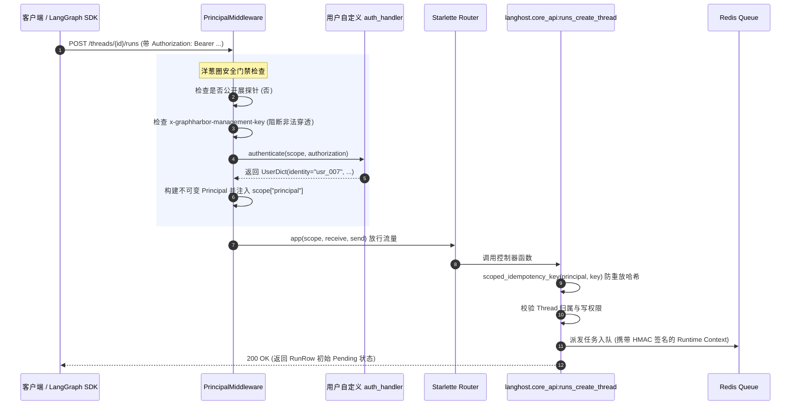

# 02-ASGI 协议网关、REST 契约与 Principal 隔离

> **模块定位与核心价值**：本模块作为 GraphHarbor 暴露于公网/内网网络边界的**统一协议接入中枢与安全防线**。它基于高性能轻量级 Starlette ASGI 框架构建，承担着“对上 100% 兼容与欺骗 LangGraph 官方 SDK 与 Studio 调试器”、“对中拦截未授权访问并构建防水平越权（IDOR）的 `Principal` 安全上下文”、以及“对下解耦分发 Core REST 与 Agent Protocol 双轨指令”的核心职责。

---

## 零、知识前置与上下文串联（Knowledge Bridges）

### 1. 认知输入（前置网络契约输入）
- **官方客户端请求**：来自 `langgraph-sdk`（Python / TS）、LangSmith Studio UI 或第三方 Web 前端的标准 HTTP/SSE 请求；
- **传输凭证头**：`Authorization: Bearer <token>`（或用于控制面的私有秘钥）、`Last-Event-ID`（流式断线续传游标）、`Idempotency-Key`（防重放幂等键）；
- **动态认证扩展**：在 [langgraph.json](file:///Users/lijiaxin/PyCharmMiscProject/graphharbor/langgraph.json) 中配置的自定义 `auth` 处理器（通过 `auth.path` 导入的验证函数或类）。

### 2. 本章核心流转
- **协议入口与端点树路由**：[`langhost.server.create_app`](file:///Users/lijiaxin/PyCharmMiscProject/graphharbor/libs/langhost/src/langhost/server.py) 组装 Starlette 实例，按标准挂载 40+ 个 Core REST 端点、Agent Protocol 命令通道（`/commands`）、Model Context Protocol 传输桥（`/mcp`）与 Prometheus 探针；
- **洋葱圈鉴权守卫（PrincipalMiddleware）**：[`langgraph_runtime_pg.auth.PrincipalMiddleware`](file:///Users/lijiaxin/PyCharmMiscProject/graphharbor/libs/langgraph-runtime-pg/src/langgraph_runtime_pg/auth.py) 拦截所有数据面流量。除健康探针（`/ok`, `/live`, `/ready`）与能力文档（`/info`）外，生产环境强制执行“默认拒绝（Fail-Closed）”，调用自定义 `auth_handler` 解析并绑定不可变数据类 [`Principal`](file:///Users/lijiaxin/PyCharmMiscProject/graphharbor/libs/langgraph-runtime-pg/src/langgraph_runtime_pg/auth.py) 至 `request.scope`；
- **租户隔离与幂等绑定**：系统将客户端传入的 `Idempotency-Key` 结合 `Principal.subject` 执行 SHA-256 加盐哈希（`scoped_idempotency_key`），并在后续持久化查询中校验资源所有权，彻底杜绝跨租户水平越权（IDOR）；
- **双轨协议分发**：根据请求路径，将流量派发至 [`core_api`](file:///Users/lijiaxin/PyCharmMiscProject/graphharbor/libs/langhost/src/langhost/core_api.py)（标准 REST 资源操作）或 [`protocol_api`](file:///Users/lijiaxin/PyCharmMiscProject/graphharbor/libs/langhost/src/langhost/protocol_api.py)（Agent Protocol 命令事件流）。

<details>
<summary>💡 <b>老王 30 秒原地折叠小拐杖：官方协议黑盒适配与客户端欺骗</b>（点击展开）</summary>

> 1. **生活大白话类比**：就像买了一个通用 Type-C 快充头，只要它能正确响应苹果、华为、小米的私有握手协议（`/info` 能力探针与状态报文），手机一插上去就会老老实实激活百瓦超级快充，根本不知道充电头里其实是自研电路板！
> 2. **解决的生产痛点**：如果不 100% 对齐官方协议，所有使用 LangSmith Studio 可视化界面的开发者、使用官方 SDK 的前端团队，全都要重写一套客户端代码；而 GraphHarbor 做到即插即用、零代码迁移。
> 3. **落地映射与传送门**：本项目在 [`server.py`](file:///Users/lijiaxin/PyCharmMiscProject/graphharbor/libs/langhost/src/langhost/server.py) 与 [`core_api.py`](file:///Users/lijiaxin/PyCharmMiscProject/graphharbor/libs/langhost/src/langhost/core_api.py) 落地。深度源码解密直达专篇 👉 [01-官方协议黑盒适配：如何 100% 欺骗官方前端与客户端 SDK](concepts/01-langgraph-protocol-adaptation.md)。

</details>

<details>
<summary>💡 <b>老王 30 秒原地折叠小拐杖：Principal 上下文与跨租户越权防护 (IDOR)</b>（点击展开）</summary>

> 1. **生活大白话类比**：就像去高档洗浴中心，服务员发给你 88 号带防伪芯片的手牌（Principal）。你只能开 88 号更衣柜，不能拿记号笔在手牌上改成 89 号就去开别的大哥的柜子（IDOR 越权）；更不能拿管理办公室钥匙去开更衣柜（控制面凭据隔离）。
> 2. **解决的生产痛点**：多租户环境下，攻击者通过抓包拿到其他用户的 `thread_id`，若网关只认 Token 有效性而不校验所有权，他人与大模型的私密聊天记录将被全部盗取（商业机密泄露）。
> 3. **落地映射与传送门**：本项目在 [`auth.py`](file:///Users/lijiaxin/PyCharmMiscProject/graphharbor/libs/langgraph-runtime-pg/src/langgraph_runtime_pg/auth.py) 与 [`authorization.py`](file:///Users/lijiaxin/PyCharmMiscProject/graphharbor/libs/langgraph-runtime-pg/src/langgraph_runtime_pg/authorization.py) 落地。深度源码解密直达专篇 👉 [02-Token 校验、Principal 上下文与线程所有权隔离](concepts/02-principal-and-token-isolation.md)。

</details>

### 3. 认知输出（支撑后续模块）
- 为 **[03-persistence-and-fencing]** 输送携带合法所有权（Owner）与经过协议清洗的快照写入请求；
- 为 **[04-distributed-scheduler-and-worker]** 派发带 HMAC 签名凭据（`sign_runtime_context`）的安全任务消息；
- 为 **[05-execution-and-streaming]** 建立保持活跃心跳（Keep-Alive）的高并发 SSE 流式推送通道。

---

## 一、对立视角：简易原型 vs 生产架构（Naive vs Production）

### 1. 核心维度演进与选型考量表

| 维度 | 简易原型方案 (Naive) | 生产级实现 (Production Reality) | 选型与演进考量 |
| :--- | :--- | :--- | :--- |
| **框架选型与开销** | 采用厚重的 FastAPI 框架，依赖大量自动依赖注入与 Pydantic 运行时反射校验。 | **纯净原生 Starlette ASGI 管道**：零冗余框架包装，路由分发纳秒级直通。 | 在超高并发与海量 SSE 打字机流式长连接下，极大压低内存驻留与 GC 频率。 |
| **鉴权模型与越权** | 只要 Header 带有效 Token 就直接放行，业务接口内不校验当前资源归属人。 | **不可变 `Principal` 上下文 + 加盐哈希幂等键 + 数据面行级隔离**。 | 彻底杜绝水平越权攻击（IDOR），并防止多租户之间重放相同的 Idempotency Key 导致碰撞。 |
| **凭证权限混淆** | 管理员运维 Key（Management Key）可以直接调用数据面接口偷看对话。 | **管理面与数据面物理隔离**：`PrincipalMiddleware` 检测到运维头直接 403 击毙。 | 杜绝权限提权（Privilege Escalation）与运维凭据被劫持后引发的大规模数据泄密。 |
| **官方生态兼容** | 自定义一套 `/api/chat`，要求前端团队改写 SDK 并放弃官方调试工具。 | **100% 像素级对齐官方 Core REST / SSE 协议**，提供 `/info` 能力自协商。 | 无缝接入 LangSmith Studio 与官方所有多语言 SDK，完全无需二开前端。 |

### 2. 20 行极简对立代码演示

```python
# ❌ 简易原型 (Naive Demo)：信任入参，未做租户所有权绑定与凭证隔离
async def naive_create_run(request: Request, thread_id: str):
    user_token = request.headers.get("Authorization")
    # 致命伤 1：只要有 Token 就放行，根本没核对这个 thread_id 到底是不是该用户的！
    # 致命伤 2：客户端如果传了相同的 idempotency_key，不同租户之间会直接相互覆盖
    run = db.create_run(thread_id=thread_id, key=request.headers.get("Idempotency-Key"))
    return {"run_id": run.id}

# ✅ 生产级实现 (GraphHarbor Production)：强制 Principal 绑定 + 加盐幂等哈希 + 严格所有权
async def production_create_run(request: Request, thread_id: UUID):
    principal = principal_from_scope(request.scope)  # 严格从中间件安全上下文获取
    # 核心防守 1：以 subject 为盐对 Idempotency-Key 进行单向哈希，杜绝跨租户碰撞
    scoped_key = principal.idempotency_key(request.headers.get("Idempotency-Key"))
    # 核心防守 2：行级检查 Thread 归属，杜绝 IDOR 水平越权
    thread, _ = await _get_thread(request, thread_id=thread_id, action="write")
    if not in_principal_scope(thread, principal):
        raise HTTPException(403, "Forbidden: you do not own this thread")
    return await runs_create_thread(request, thread=thread, key=scoped_key)
```

---

## 二、源码精准坐标映射（Code Pointer Map）

| 职责划分 | 核心代码路径 | 关键类 / 函数 / 契约入口 | 生产核心职责 |
| :--- | :--- | :--- | :--- |
| **ASGI 网关组装** | [`libs/langhost/src/langhost/server.py`](file:///Users/lijiaxin/PyCharmMiscProject/graphharbor/libs/langhost/src/langhost/server.py) | `create_app()`, `_openapi_document()` | 注册 40+ 个路由、挂载 CORS 中间件与 MCP 传输路由 |
| **官方能力协商** | [`libs/langhost/src/langhost/server.py`](file:///Users/lijiaxin/PyCharmMiscProject/graphharbor/libs/langhost/src/langhost/server.py) | `_info()`, `official_info_document()` | 对外返回 100% 官方对齐的能力清单与版本元数据 |
| **身份与租户中间件** | [`libs/langgraph-runtime-pg/src/langgraph_runtime_pg/auth.py`](file:///Users/lijiaxin/PyCharmMiscProject/graphharbor/libs/langgraph-runtime-pg/src/langgraph_runtime_pg/auth.py) | `PrincipalMiddleware`, `Principal` | 拦截未授权访问，解析用户身份，阻断管理面凭据越权 |
| **上下文防篡改签名** | [`libs/langgraph-runtime-pg/src/langgraph_runtime_pg/auth.py`](file:///Users/lijiaxin/PyCharmMiscProject/graphharbor/libs/langgraph-runtime-pg/src/langgraph_runtime_pg/auth.py) | `sign_runtime_context()`, `verify_runtime_context()` | 基于 HMAC-SHA256 签发 60s 短时运行时执行凭证 |
| **Core REST 控制器** | [`libs/langhost/src/langhost/core_api.py`](file:///Users/lijiaxin/PyCharmMiscProject/graphharbor/libs/langhost/src/langhost/core_api.py) | `threads_*`, `runs_*`, `assistants_*` | 处理 Assistants、Threads、Runs 的增删改查标准契约 |
| **Agent Protocol 适配** | [`libs/langhost/src/langhost/protocol_api.py`](file:///Users/lijiaxin/PyCharmMiscProject/graphharbor/libs/langhost/src/langhost/protocol_api.py) | `protocol_commands()`, `protocol_event_stream()` | 官方 Agent Protocol `/commands` 指令与事件流双向通信 |
| **MCP 传输桥接** | [`libs/langhost/src/langhost/mcp_transport.py`](file:///Users/lijiaxin/PyCharmMiscProject/graphharbor/libs/langhost/src/langhost/mcp_transport.py) | `create_mcp_transport()` | 暴露 Model Context Protocol 端点，支持大模型直接调用底层 Graph |

---

## 三、真实数据结构与报文（Real Payloads & DB Schemas）

### 1. 真实能力嗅探协商报文 (`GET /info`)
当 LangSmith Studio 或 SDK 首次连接服务时，会发起 `GET /info` 请求：

```http
GET /info HTTP/1.1
Host: 127.0.0.1:31296
Accept: application/json
```

GraphHarbor 返回严格对齐官方闭源服务的能力定义：
```json
{
  "version": "0.13.0",
  "flags": {
    "assistants": true,
    "threads": true,
    "runs": true,
    "crons": true,
    "store": true,
    "mcp": true
  },
  "runtime": "pg",
  "auth": {
    "enabled": true
  }
}
```

### 2. 真实 HMAC 签名后的运行时委托凭证 (Runtime Context Token)
当 Run 进入任务队列派发给底层 Worker 时，网关会利用 `sign_runtime_context` 签发防篡改短时凭证：

```text
eyJhbGciOiJIUzI1NiIsInR5cCI6IkpXVCJ9...<base64_json_claims>...7f83b1657ff1fc53b92dc18148a1d65dfc2d4b1fa3d677284addd200126d9069
```

其解码后的 JSON Payload 结构如下：
```json
{
  "v": 2,
  "accepted_at": 1727730000,
  "run_id": "7a3539a2-4a0b-47e9-a35f-14923e1136b8",
  "thread_id": "c1f7b889-8d76-47a3-83eb-811c750b3f52",
  "context": {
    "accepted_at": 1727730000,
    "permissions": ["runs:create", "threads:read"],
    "auth_user": {
      "identity": "usr_99812",
      "display_name": "Senior Architect",
      "roles": ["developer"]
    },
    "request_id": "req-9876543210"
  },
  "iss": "graphharbor-gateway",
  "aud": "graphharbor-worker"
}
```

---

## 四、端到端函数级调用时序（Function-Level Trace）

下图展现客户端请求如何经过 Starlette 网关、`PrincipalMiddleware` 鉴权、提取安全上下文并派发给核心服务：



---

## 五、核心实现高保真伪代码（High-Fidelity Pseudocode）

以下伪代码提炼自 `auth.py` 与 `core_api.py`，完整呈现网关层拦截与防越权逻辑：

```python
# 剥离次要细节，呈现 ASGI 网关的核心安全中间件拦截
class PrincipalMiddleware:
    def __init__(self, app: ASGIApp, *, auth_handler: Any, allow_anonymous: bool):
        self.app = app
        self.auth_handler = auth_handler
        self.allow_anonymous = allow_anonymous

    async def __call__(self, scope: Scope, receive: Receive, send: Send):
        # 1. 允许公开健康探针无鉴权放行
        if scope["type"] == "http" and scope["path"] in {"/ok", "/live", "/ready", "/info"}:
            return await self.app(scope, receive, send)

        headers = dict(scope.get("headers", []))
        
        # 2. 核心红线：严禁管理面运维 Key 访问数据面业务资源
        if b"x-graphharbor-management-key" in headers:
            return await send_json_error(send, 403, "Management key cannot access data-plane")

        auth_header = headers.get(b"authorization", b"").decode("latin-1")
        
        # 3. 生产环境严格闭环检查
        if not auth_header and self.auth_handler is None:
            if not self.allow_anonymous:
                return await send_json_error(send, 401, "Missing authorization header")
            return await self.app(scope, receive, send)

        # 4. 执行用户自定义认证逻辑并提取不可变主体
        try:
            raw_user = await self.auth_handler.authenticate(scope=scope, auth_header=auth_header)
            scope["principal"] = Principal.from_auth_user(raw_user)
        except AuthenticationError as exc:
            return await send_json_error(send, exc.status_code, str(exc))

        # 5. 放行进入业务路由层
        await self.app(scope, receive, send)
```

---

## 六、假想断电与极限场景推演（Thought Experiments）

### 场景一：恶意攻击者发起 IDOR 水平越权窃取他人对话历史
- **推演过程**：攻击者拥有合法账号（`identity: "usr_attacker"`），通过暴力枚举或抓包猜到了受害者账号的 `thread_id`（`uuid_victim`）。攻击者携带自身合法 Token 发起 `GET /threads/{uuid_victim}/history`。
- **系统表现**：
  1. `PrincipalMiddleware` 成功验证了攻击者的 Token，但将其 `scope["principal"].subject` 锁定为 `"usr_attacker"`；
  2. 控制器进入 `core_api._get_thread`，执行数据库查询并调用 `in_principal_scope(thread, principal)`；
  3. 系统发现该 Thread 的元数据拥有者与当前主体不匹配，**当场返回 403 Forbidden 强行切断响应**，攻击者无法读取哪怕一个字符的聊天记录。

### 场景二：攻击者利用泄露的运维管理秘钥试图读取智能体状态
- **推演过程**：攻击者窃取了平台部署时配置的 `X-GraphHarbor-Management-Key`，试图调用 `GET /threads/{thread_id}/state` 提取数据。
- **系统表现**：`PrincipalMiddleware` 在进入认证前首先扫描 Header。一旦发现 `x-graphharbor-management-key`，中间件立即短路执行 `_json_error(send, 403, "management credentials cannot access data-plane resources")`。管理面凭据被物理隔离在数据面之外，彻底杜绝权限混淆漏洞。

### 场景三：高并发网络重试下的 Idempotency Key 撞库攻击
- **推演过程**：不同租户的两个用户无意间（或恶意）使用了相同的 `Idempotency-Key: "order_submit_001"` 并发派发任务。
- **系统表现**：系统在生成数据库唯一键时，强制调用 `principal.idempotency_key("order_submit_001")`，通过 `sha256(f"{self.subject}\0{key}".encode())` 执行加盐哈希。两个用户派发的实际数据库键分别为 `auth:<hash_userA>` 与 `auth:<hash_userB>`，彼此完全隔离，绝不会因为 Key 相同发生任务覆盖或假性幂等拦截。

---

## 七、架构不变量清单（Architectural Invariants）

在未来的任何网关层扩展、路由改动或中间件重构中，必须死守以下三条红线规则：

1. **生产环境默认失败不变量（Production Fail-Closed Invariant）**：
   在 `GRAPHHARBOR_ENV=production` 下，除预先核准的健康探针（`/ok`, `/live`, `/ready`, `/info`）外，所有数据面接口必须经过鉴权，严禁任何未授权匿名请求穿透至业务路由！
2. **管理面凭据物理隔离不变量（Plane Separation Invariant）**：
   `X-GraphHarbor-Management-Key` 只能用于后续独立的集群控制面管理端点，绝对禁止在数据面接口中被视作合法凭证。
3. **幂等键主体绑定不变量（Scoped Idempotency Invariant）**：
   任何存入数据库 `runs.idempotency_key` 唯一索引的键值，必须与当前经过验证的 `Principal.subject` 强哈希绑定，严禁直接保存客户端传入的裸字符串！
