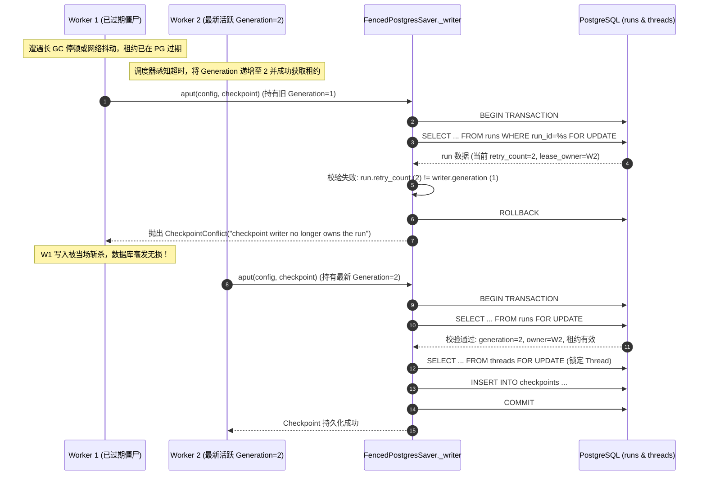

# 03-PostgreSQL 状态机、Fenced Checkpoint 与事务原子性

> **模块定位与核心价值**：本模块是 GraphHarbor 作为生产级通用 Agent Server 的**状态持久化中枢与一致性死线**。它在纯开源的 PostgreSQL 基础设施之上，构建了对标甚至超越闭源 LangGraph Cloud 的可靠状态存储底座。通过**栅栏检查点（FencedPostgresSaver）**、**行级排他锁序列化**与**状态突变基线镜像（Baseline Snapshot）**，彻底解决了多节点并发写冲突、网络抖动引发的僵尸 Worker 脑裂写穿、以及 Human-in-the-loop 场景下的状态原子回滚难题。

---

## 零、知识前置与上下文串联（Knowledge Bridges）

### 1. 认知输入（前置调用与上下文输入）
- **执行栈上下文**：来自 Worker 或执行核的 [`checkpoint_writer`](file:///Users/lijiaxin/PyCharmMiscProject/graphharbor/libs/langgraph-runtime-pg/src/langgraph_runtime_pg/checkpoint_mutations.py) 上下文变量（包含三元组：`run_id: str`, `lease_owner: str`, `generation: int`）。
- **LangGraph 图执行配置**：标准 `RunnableConfig`，包含 `configurable` 字典（`thread_id`, `checkpoint_ns`, `checkpoint_id`）与元数据。
- **底层连接池契约**：[`langgraph_runtime_pg.database.start_pool()`](file:///Users/lijiaxin/PyCharmMiscProject/graphharbor/libs/langgraph-runtime-pg/src/langgraph_runtime_pg/database.py) 提供的生产级 `psycopg_pool.AsyncConnectionPool` 实例。

### 2. 本章核心流转
- **双重锁与栅栏过滤（Fencing Token Verification）**：在 [`FencedPostgresSaver._writer`](file:///Users/lijiaxin/PyCharmMiscProject/graphharbor/libs/langgraph-runtime-pg/src/langgraph_runtime_pg/checkpoint.py) 中，首先以 `SELECT ... FOR UPDATE` 锁住当前 Run 与 Thread，强制比对 `lease_owner`、`retry_count == generation` 以及租约是否有效（`lease_expires_at > now()`）；
- **活跃任务自身放行与并发拦截**：若无外部显式 writer 上下文（例如执行节点在步骤内部保存增量快照），系统从 `config` 中解析 `run_id`，精确放行当前活跃 Run 自身，同时严密拦截外部非法写与回滚中的并发修改（抛出 `CheckpointConflict`）；
- **快照基线自动捕获与回滚（Baseline & Rollback）**：在 Run 启动时由 [`capture_baseline`](file:///Users/lijiaxin/PyCharmMiscProject/graphharbor/libs/langgraph-runtime-pg/src/langgraph_runtime_pg/checkpoint_mutations.py) 保存前序快照至 `run_checkpoint_baselines`；若 Run 失败或外部请求回滚，执行 [`rollback_run`](file:///Users/lijiaxin/PyCharmMiscProject/graphharbor/libs/langgraph-runtime-pg/src/langgraph_runtime_pg/checkpoint_mutations.py) 实现毫秒级事务原子回退；
- **子命名空间定向路由（Subagent Checkpoint Namespace）**：完整放通 `checkpoint_ns`，并在多层级子智能体调用中绕过 Pregel 静态拓扑解析崩溃，直通底层检查点表读取树形轨迹。

<details>
<summary>💡 <b>老王 30 秒原地折叠小拐杖：Fencing Token 与世代防脑裂</b>（点击展开）</summary>

> 1. **生活大白话类比**：就像五金店租发电机，老王发给张三一把带编码的钥匙（代际 Generation=1）。张三租期到了不还且联系不上，老王立刻换了锁心并把新钥匙（Generation=2）发给李四。张三突然冒出来拿旧钥匙开锁，锁孔防盗模块瞬间报警并当场锁死！
> 2. **解决的生产痛点**：分布式 Worker 发生 GC 停顿或机房网络瞬断，调度器以为旧 Worker 死了，将任务转交新 Worker；旧 Worker 复活后不知道自己已被剥夺权利，依然向数据库写状态，就会把新状态覆盖抹杀（脑裂写穿）。
> 3. **落地映射与传送门**：本项目在 [`checkpoint.py`](file:///Users/lijiaxin/PyCharmMiscProject/graphharbor/libs/langgraph-runtime-pg/src/langgraph_runtime_pg/checkpoint.py) 的 `FencedPostgresSaver` 落地。深度源码解密直达专篇 👉 [01-生产防裂脑：Fencing Token、Generation 代际递增与过期写拦截](concepts/01-fencing-token-and-split-brain.md)。

</details>

<details>
<summary>💡 <b>老王 30 秒原地折叠小拐杖：子智能体命名空间路由 (checkpoint_ns)</b>（点击展开）</summary>

> 1. **生活大白话类比**：董事长给总经理派活，总经理又把任务拆解给法务、财务和技术三位总监。如果所有总监的工作底稿、草稿全堆在董事长办公桌的同一个抽屉里，互相涂改覆盖，董事长一拉抽屉就得当场脑溢血。
> 2. **解决的生产痛点**：嵌套智能体（Multi-Agent Supervisor/Worker）中，子图由动态 Tool 唤起。如果持久化层不按命名空间隔离，子图工具调用轨迹要么把主图状态冲垮，要么在历史回溯时直接报 `ValueError: Subgraph not found`。
> 3. **落地映射与传送门**：本项目在 [`core_api.py`](file:///Users/lijiaxin/PyCharmMiscProject/graphharbor/libs/langhost/src/langhost/core_api.py) 与 [`checkpoint.py`](file:///Users/lijiaxin/PyCharmMiscProject/graphharbor/libs/langgraph-runtime-pg/src/langgraph_runtime_pg/checkpoint.py) 落地。深度源码解密直达专篇 👉 [02-子智能体历史穿越：定向 checkpoint_ns 路由与嵌套调用轨迹持久化](concepts/02-subagent-checkpoint-namespace.md)。

</details>

### 3. 认知输出（支撑后续模块）
- 为 **[02-gateway-and-protocol]** 提供 100% 官方对齐的 `/threads/{thread_id}/state` 与 `/threads/{thread_id}/history` 状态查询响应；
- 为 **[05-execution-and-streaming]** 提供 Run 执行过程中的中间断点持久化与 Human-in-the-loop 中断恢复凭证。

---

## 一、对立视角：简易原型 vs 生产架构（Naive vs Production）

### 1. 核心维度演进与选型考量表

| 维度 | 简易原型方案 (Naive) | 生产级实现 (Production Reality) | 选型与演进考量 |
| :--- | :--- | :--- | :--- |
| **并发写入保护** | 直接调用官方开源 `AsyncPostgresSaver`，无外层并发协调与行锁排他。 | **行级锁排他序列化**：`SELECT thread_id FROM threads WHERE thread_id=%s FOR UPDATE`。 | 杜绝客户端多点触发 Run 时破坏 Checkpoint 链条连续性，强行排队保序。 |
| **脑裂防写穿** | 信任执行节点，只要连接没断，任何 Worker 随时可写入任意 Checkpoint。 | **Fencing Token 世代校验**：比对 `lease_owner` + `retry_count == generation` + 租约有效期。 | 发生网络分区或 Worker 假死恢复时，过期代际写入当场以 `CheckpointConflict` 击毙。 |
| **执行回滚原子性** | 运行失败时手动调用 SQL 尝试删除最近几行，容易残留中间 Step 脏数据。 | **Run 前置全量基线镜像（Baseline Snapshot）**：落入 `run_checkpoint_baselines` 单事务秒级恢复。 | 保证失败或取消时，状态机能够无损、原子性地退回至 Run 启动前的绝对一致态。 |
| **多智能体状态隔离** | 忽视 `checkpoint_ns`，子图与根图混杂写入默认空命名空间。 | **全链路透传 `checkpoint_ns`**，当子图为动态工具生成时智能绕过静态拓扑直读底层。 | 完美支持树形嵌套多智能体体系，子图工具调用历史 100% 可审计、可时光倒流回溯。 |

### 2. 20 行极简对立代码演示

```python
# ❌ 简易原型 (Naive Demo)：无保护直接调用开源 Saver，极易引发脑裂与并发撕裂
async def naive_save_checkpoint(config, checkpoint):
    saver = AsyncPostgresSaver(conn_pool)
    # 致命伤 1：没有检查当前 Worker 的租约是否被收割！
    # 致命伤 2：没有锁定 Thread 行，多个并发写入直接互相践踏生成孤儿 Checkpoint
    await saver.aput(config, checkpoint, metadata={}, new_versions={})

# ✅ 生产级实现 (GraphHarbor Production)：Fencing Token 拦截 + 事务行级排他锁
class FencedPostgresSaver(AsyncPostgresSaver):
    @asynccontextmanager
    async def _writer(self, config: RunnableConfig):
        writer = checkpoint_writer.get()
        async with self.conn.connection() as conn, conn.transaction():
            if writer:
                run_id, owner, generation = writer
                # 核心防守：行级锁校验租约归属与世代单调递增
                cursor = await conn.execute(
                    "SELECT status, lease_owner, retry_count, lease_expires_at > now() AS valid "
                    "FROM runs WHERE run_id=%s FOR UPDATE", (run_id,)
                )
                run = await cursor.fetchone()
                if not run or run["status"] != "running" or not run["valid"] \
                   or run["lease_owner"] != owner or run["retry_count"] != generation:
                    raise CheckpointConflict("checkpoint writer no longer owns the run")
            # 锁定 Thread 互斥写
            await conn.execute("SELECT thread_id FROM threads WHERE thread_id=%s FOR UPDATE", ...)
            yield AsyncPostgresSaver(conn, serde=self.serde)
```

---

## 二、源码精准坐标映射（Code Pointer Map）

| 职责划分 | 核心代码路径 | 关键类 / 函数 / 协议契约 | 生产核心职责 |
| :--- | :--- | :--- | :--- |
| **栅栏检查点包装器** | [`libs/langgraph-runtime-pg/src/langgraph_runtime_pg/checkpoint.py`](file:///Users/lijiaxin/PyCharmMiscProject/graphharbor/libs/langgraph-runtime-pg/src/langgraph_runtime_pg/checkpoint.py) | `FencedPostgresSaver` | 继承官方 `AsyncPostgresSaver`，重写 `_writer` 上下文注入排他锁与世代校验 |
| **检查点全局工厂** | [`libs/langgraph-runtime-pg/src/langgraph_runtime_pg/checkpoint.py`](file:///Users/lijiaxin/PyCharmMiscProject/graphharbor/libs/langgraph-runtime-pg/src/langgraph_runtime_pg/checkpoint.py) | `setup_checkpointer()`, `Checkpointer()` | 管理单例 `AsyncConnectionPool`，执行无锁表结构初始化与优雅重启 |
| **写者上下文守卫** | [`libs/langgraph-runtime-pg/src/langgraph_runtime_pg/checkpoint_mutations.py`](file:///Users/lijiaxin/PyCharmMiscProject/graphharbor/libs/langgraph-runtime-pg/src/langgraph_runtime_pg/checkpoint_mutations.py) | `checkpoint_writer: ContextVar` | 跨协程传递 `(run_id, lease_owner, generation)` 凭证，防止外部入参伪造 |
| **基线快照与原子回滚**| [`libs/langgraph-runtime-pg/src/langgraph_runtime_pg/checkpoint_mutations.py`](file:///Users/lijiaxin/PyCharmMiscProject/graphharbor/libs/langgraph-runtime-pg/src/langgraph_runtime_pg/checkpoint_mutations.py) | `capture_baseline()`, `rollback_run()` | Run 执行前冻结历史检查点；取消或失败时单事务全量还原，杜绝脏数据 |
| **冲突安全异常** | [`libs/langgraph-runtime-pg/src/langgraph_runtime_pg/checkpoint_mutations.py`](file:///Users/lijiaxin/PyCharmMiscProject/graphharbor/libs/langgraph-runtime-pg/src/langgraph_runtime_pg/checkpoint_mutations.py) | `CheckpointConflict` | 状态机排他保护的专用异常，阻断任何非法或过期的持久化修改 |
| **命名空间路由适配** | [`libs/langhost/src/langhost/core_api.py`](file:///Users/lijiaxin/PyCharmMiscProject/graphharbor/libs/langhost/src/langhost/core_api.py) | `_checkpoint_config()`, `threads_state()` | 解析 `checkpoint_ns`，处理 Pregel 动态子图缺失回退逻辑 |

---

## 三、真实数据结构与报文（Real Payloads & DB Schemas）

### 1. 真实 Checkpoint 物理存储表结构 (`checkpoints` & `checkpoint_writes`)
系统复用并加固了标准检查点物理 Schema：

```sql
-- 检查点主快照表
CREATE TABLE checkpoints (
    thread_id TEXT NOT NULL,
    checkpoint_ns TEXT NOT NULL DEFAULT '',
    checkpoint_id TEXT NOT NULL,
    parent_checkpoint_id TEXT,
    type TEXT,
    checkpoint JSONB NOT NULL,
    metadata JSONB NOT NULL DEFAULT '{}'::jsonb,
    PRIMARY KEY (thread_id, checkpoint_ns, checkpoint_id)
);

-- 节点任务待写入缓冲区 (Pending Writes)
CREATE TABLE checkpoint_writes (
    thread_id TEXT NOT NULL,
    checkpoint_ns TEXT NOT NULL DEFAULT '',
    checkpoint_id TEXT NOT NULL,
    task_id TEXT NOT NULL,
    idx INTEGER NOT NULL,
    channel TEXT NOT NULL,
    type TEXT,
    blob BYTEA NOT NULL,
    PRIMARY KEY (thread_id, checkpoint_ns, checkpoint_id, task_id, idx)
);
```

### 2. 真实回滚基线镜像结构 (`run_checkpoint_baselines`)
查阅 [`models.py`](file:///Users/lijiaxin/PyCharmMiscProject/graphharbor/libs/langgraph-runtime-pg/src/langgraph_runtime_pg/models.py) 中的 `RunCheckpointBaselineRow`，其在数据库中捕获的数据结构如下：

```json
{
  "run_id": "7a3539a2-4a0b-47e9-a35f-14923e1136b8",
  "thread_id": "c1f7b889-8d76-47a3-83eb-811c750b3f52",
  "checkpoints": [
    {
      "thread_id": "c1f7b889-8d76-47a3-83eb-811c750b3f52",
      "checkpoint_ns": "",
      "checkpoint_id": "1ef7e221-a3bf-6e60-8000-7db0a2d59648",
      "checkpoint": {"v": 1, "channel_values": {"messages": [...]}}
    }
  ],
  "writes": [],
  "projection": {
    "_captured_at": "2026-09-30T21:10:00.123456+00:00",
    "status": "idle",
    "values_": {"messages": [...]},
    "interrupts": {},
    "error": null
  }
}
```

### 3. 子智能体命名空间状态查询报文 (HTTP)
向网关请求特定子智能体（如工具调起的代码评审子代理）的状态快照：

```http
POST /threads/c1f7b889-8d76-47a3-83eb-811c750b3f52/state/checkpoint HTTP/1.1
Host: 127.0.0.1:31296
Content-Type: application/json

{
  "checkpoint": {
    "checkpoint_ns": "tools:call_code_reviewer_99a8b"
  }
}
```

响应体标准返回子图命名空间下的私有通道状态与执行栈：
```json
{
  "values": {
    "subagent_review_feedback": "Code LGTM. Zero syntax errors."
  },
  "next": [],
  "checkpoint": {
    "thread_id": "c1f7b889-8d76-47a3-83eb-811c750b3f52",
    "checkpoint_ns": "tools:call_code_reviewer_99a8b",
    "checkpoint_id": "1ef7e225-b8aa-67c0-8001-9bc1a3d44112"
  },
  "metadata": {
    "step": 2,
    "source": "loop"
  }
}
```

---

## 四、端到端函数级调用时序（Function-Level Trace）

下图清晰揭示在多 Worker 分布式环境下，`FencedPostgresSaver` 如何通过行级排他锁拦截过期脑裂 Worker 写入：



---

## 五、核心实现高保真伪代码（High-Fidelity Pseudocode）

以下伪代码提炼自 `checkpoint.py` 与 `checkpoint_mutations.py`，呈现完整的栅栏防护与多重锁逻辑：

```python
# 剥离次要逻辑，呈现真实的防御性 Checkpoint 写入流水线
async def guarded_checkpoint_writer(*, config: RunnableConfig, checkpoint_data: dict):
    thread_id = str(config["configurable"]["thread_id"])
    writer_context = checkpoint_writer.get()  # 获取 (run_id, owner, generation)

    async with db_pool.connection() as conn:
        async with conn.transaction():
            # 1. 栅栏代际防线 (Fencing Guard)
            if writer_context is not None:
                run_id, owner, generation = writer_context
                row = await conn.fetch_one(
                    "SELECT status, lease_owner, retry_count, lease_expires_at > now() AS is_valid "
                    "FROM runs WHERE run_id = %s FOR UPDATE",
                    run_id,
                )
                if (not row 
                    or row["status"] != "running" 
                    or not row["is_valid"]
                    or row["lease_owner"] != owner 
                    or row["retry_count"] != generation):
                    # 斩杀过期代际或已失权的写请求
                    raise CheckpointConflict("checkpoint writer no longer owns the run")

            # 2. 线程独占锁防线 (Thread Serialization Guard)
            if is_uuid(thread_id):
                await conn.execute("SELECT thread_id FROM threads WHERE thread_id = %s FOR UPDATE", thread_id)
                
                # 3. 运行中任务状态保护：如果不是显式持权 writer，必须校验是否有并发活跃任务
                if writer_context is None:
                    current_run_id = extract_run_id_from_config(config)
                    active_runs = await conn.fetch_all(
                        "SELECT run_id, status, reason FROM runs WHERE thread_id = %s "
                        "AND (status = 'running' OR reason = 'rollback')",
                        thread_id,
                    )
                    for r in active_runs:
                        if r["reason"] == "rollback" or (current_run_id and r["run_id"] != current_run_id):
                            raise CheckpointConflict("thread has an active run or rollback in progress")

            # 4. 执行真正的底层插入
            await raw_postgres_saver.insert(config, checkpoint_data)
```

---

## 六、假想断电与极限场景推演（Thought Experiments）

### 场景一：网络分区导致旧 Worker “假死”后复活写状态（脑裂写穿）
- **推演过程**：Worker A 正在运行图的 Step 3，突然网络分区 15 秒。后台 Reaper 进程介入，判定 Worker A 超时，将数据库 `runs.retry_count` 递增为 2 并转交 Worker B。随后网络恢复，Worker A 毫不知情，唤起数据库连接试图执行 `saver.aput()` 保存 Step 3 的 Checkpoint。
- **系统表现**：Worker A 进入 `FencedPostgresSaver._writer`，执行 `SELECT ... FOR UPDATE`。查出当前数据库中的 `retry_count=2`，而自身凭证中的 `generation=1`，代际校验失败，立即抛出 `CheckpointConflict`，写入被数据库物理阻断。Worker B 写入的 Step 4/5 状态安然无恙，彻底杜绝了脑裂导致的状态回退。

### 场景二：用户在 Human-in-the-loop 审批中断期间，并发发送多次修改或取消
- **推演过程**：智能体在某节点触发 Interrupt 等待人工审批。此时前端因网络延迟，用户狂点按钮，并发派发了“更新状态”与“回滚取消”两个 HTTP 请求。
- **系统表现**：第一个请求先到达，获取 `ThreadRow` 的行级锁（`FOR UPDATE`），将状态变更为 `rollback`。第二个请求在行锁上排队阻塞；等待获取到锁后，检测到 `reason == 'rollback'` 或存在活跃竞争，立刻触发 `CheckpointConflict` 安全退出。状态机始终保持单线程线性跃迁，绝不会发生脏读与双写冲突。

### 场景三：树形 Multi-Agent 架构中，子智能体递归嵌套调用工具
- **推演过程**：主智能体通过 Tool 唤起 Subagent A，Subagent A 又通过 Tool 唤起 Subagent B，形成深度嵌套的工具调用链。
- **系统表现**：各层级状态写入时分别携带独特的 `checkpoint_ns`（例如 `tools:call_sub_a/tools:call_sub_b`）。底层检查点表通过复合主键 `(thread_id, checkpoint_ns, checkpoint_id)` 形成物理树形命名空间隔离。读取时无需上层图静态拓扑支持，直接直通 Checkpointer 读取，轨迹完整无损保留。

---

## 七、架构不变量清单（Architectural Invariants）

在后续任何涉及存储层或运行时的修改中，必须无条件坚守以下三条红线规则：

1. **单调代际防护不变量（Monotonic Generation Invariant）**：
   任何向 `checkpoints` 与 `checkpoint_writes` 的写入操作，只要处于 Run 执行周期内，必须强制经过 `FencedPostgresSaver` 的 `generation` 世代核验。严禁绕过栅栏直接裸连底层数据库写入！
2. **线程互斥行锁不变量（Thread Row-Level Lock Invariant）**：
   所有修改 Thread 历史状态（包括更新状态、保存检查点、执行回滚）的事务，必须首先执行 `SELECT thread_id FROM threads WHERE thread_id=%s FOR UPDATE`，保持严格的线性串行化。
3. **回滚基线镜像对齐不变量（Baseline Snapshot Alignment Invariant）**：
   `RunCheckpointBaselineRow` 的捕获必须与 Run 的生命周期严格绑定。执行显式状态更新（State Update）时，必须同步清理旧的 Baseline，防止历史脏镜像跨版本复活。
