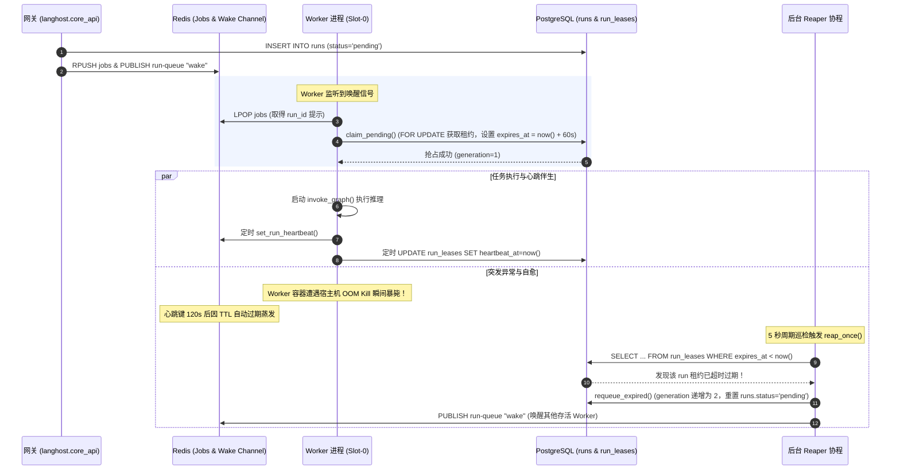

# 04-Redis 任务队列、分布式 Lease 租约与 Worker 执行核

> **模块定位与核心价值**：本模块是 GraphHarbor 处理异步长耗时 Agent 任务的**分布式任务调度心脏与容错自愈引擎**。它由两套高度协同的基础设施构建而成：轻量高效的 **Redis Streams 任务中继与 Pub/Sub 广播总线**，以及由 PostgreSQL 权威背书的**分布式行级租约（Lease）与僵尸任务收割机（Reaper）**。这套架构从底层彻底杜绝了任务丢失、惊群假死、以及 Worker 节点崩溃引发的“永久 Running 状态死锁”。

---

## 零、知识前置与上下文串联（Knowledge Bridges）

### 1. 认知输入（前置输入与任务灌入）
- **网关任务灌入**：上游网关在收到 `POST /runs` 或 `POST /threads/{id}/runs` 时，向数据库写入初始 `status='pending'` 的 [`RunRow`](file:///Users/lijiaxin/PyCharmMiscProject/graphharbor/libs/langgraph-runtime-pg/src/langgraph_runtime_pg/models.py) 实体，并调用 [`enqueue_run(run_id)`](file:///Users/lijiaxin/PyCharmMiscProject/graphharbor/libs/langgraph-runtime-pg/src/langgraph_runtime_pg/redis_stream.py) 向 Redis 压入调度 Hint 并广播唤醒信号；
- **配置与环境绑定**：`GRAPHHARBOR_LEASE_SECONDS`（默认 60s，租约有效窗口）、`GRAPHHARBOR_REAPER_INTERVAL_SECONDS`（默认 5s，收割机巡检频率）、`N_JOBS_PER_WORKER`（单 Worker 进程内并发执行槽位数）；
- **动态图注册表注入**：[`GraphRegistry`](file:///Users/lijiaxin/PyCharmMiscProject/graphharbor/libs/langgraph-runtime-pg/src/langgraph_runtime_pg/graph_registry.py) 提供的已挂载 Checkpointer 的图实例工厂。

### 2. 本章核心流转
- **单调代际防假死监听（Wait for Queue Wake）**：Worker 槽位在空闲时进入 [`wait_for_queue_wake()`](file:///Users/lijiaxin/PyCharmMiscProject/graphharbor/libs/langgraph-runtime-pg/src/langgraph_runtime_pg/redis_stream.py)，依托单调递增代际计数器 `_WAKE_GEN` 监听 Redis 唤醒通知，彻底杜绝传统 `asyncio.Event` 的丢唤醒（Lost-Wakeup）挂起假死；
- **PostgreSQL 权威原子抢占（Lease Claiming）**：Worker 弹出任务 Hint 后，绝不盲信 Redis，而是向 PostgreSQL 发起 `claim_pending` 事务，以行级排他锁抢占 `lease_owner`、刷新 `lease_expires_at` 并将状态更新为 `running`；
- **伴生心跳与超时看门狗**：任务执行期间，后台伴生协程定时刷新 PostgreSQL 租约与 Redis 心跳探针（[`set_run_heartbeat`](file:///Users/lijiaxin/PyCharmMiscProject/graphharbor/libs/langgraph-runtime-pg/src/langgraph_runtime_pg/redis_stream.py)），同时通过 `run_timeout_seconds` 防止大模型调用无限死挂；
- **事件批量缓冲与实时扇出（EventBuffer）**：执行过程中产出的流式事件，由 [`EventBuffer`](file:///Users/lijiaxin/PyCharmMiscProject/graphharbor/libs/langgraph-runtime-pg/src/langgraph_runtime_pg/production_worker.py) 攒批沉淀至 `runtime_events` 表，并毫秒级扇出至 Redis Pub/Sub 广播给前端打字机；
- **无主僵尸收割自愈（The Reaper）**：独立巡检协程定时扫描 `run_leases`，一旦发现超时且失去心跳的僵尸任务，强制将其 `retry_count + 1` 并重置为 `pending` 重新入队，同时自动执行过期事件修剪。

<details>
<summary>💡 <b>老王 30 秒原地折叠小拐杖：Redis 调度 Hint 与 PostgreSQL 权威真理源</b>（点击展开）</summary>

> 1. **生活大白话类比**：就像医院叫号系统，挂号处的电脑主数据库里躺着真实的病历档案（PostgreSQL 权威真理源）；墙上的电子叫号屏和广播喇叭（Redis Streams/PubSub）只是提醒哪个医生现在该接诊下一位患者的“提示条（Hint）”。哪怕叫号大屏幕突然断电死机，患者档案也绝对丢不了！
> 2. **解决的生产痛点**：纯依赖 Redis 做任务队列的系统，一旦 Redis 发生网络分区或主从切换，任务就会离奇失踪或重复执行；GraphHarbor 让 PostgreSQL 成为最终裁决者，Redis 即使崩溃清空，系统也能根据数据库状态自愈。
> 3. **落地映射与传送门**：本项目在 [`redis_stream.py`](file:///Users/lijiaxin/PyCharmMiscProject/graphharbor/libs/langgraph-runtime-pg/src/langgraph_runtime_pg/redis_stream.py) 与 [`ops.py`](file:///Users/lijiaxin/PyCharmMiscProject/graphharbor/libs/langgraph-runtime-pg/src/langgraph_runtime_pg/ops.py) 落地。深度源码解密直达专篇 👉 [01-高并发防假死：Wake Generation 单调递增与 Redis Pub/Sub 惊群抑制](concepts/01-redis-stream-wake-generation.md)。

</details>

<details>
<summary>💡 <b>老王 30 秒原地折叠小拐杖：双层租约与死人开关（Dead Man's Switch）收割机</b>（点击展开）</summary>

> 1. **生活大白话类比**：就像水力发电站泄洪闸门上的“失能手柄（死人开关）”，操作工必须每隔 5 分钟向监控室按一次对讲机报备“我清醒正常（心跳）”。如果超过 10 分钟没按，系统判定操作工昏迷或暴毙，备用机械臂（Reaper 收割机）立刻强行接管闸门并拉响警报！
> 2. **解决的生产痛点**：跑大模型的 Worker 经常因为 OOM 被系统强杀或断网。没有租约收割机，这些任务在数据库里就会变成永远处于 `running` 状态的僵尸死锁，用户只能干瞪眼。
> 3. **落地映射与传送门**：本项目在 [`production_worker.py`](file:///Users/lijiaxin/PyCharmMiscProject/graphharbor/libs/langgraph-runtime-pg/src/langgraph_runtime_pg/production_worker.py) 的 `_reaper_loop()` 落地。深度源码解密直达专篇 👉 [02-租约生命周期：心跳续约、租约过期判定与自愈收割机极限推演](concepts/02-distributed-lease-and-reaper.md)。

</details>

### 3. 认知输出（支撑后续模块）
- 为 **[03-persistence-and-fencing]** 准确提供处于合法执行代际的 `(run_id, owner, generation)` 凭据，支撑 `FencedPostgresSaver` 进行世代核验；
- 为 **[05-execution-and-streaming]** 驱动 `GraphExecutor` 产生有序的打字机事件流，并维护 `ThreadRow` 的最终状态机跃迁。

---

## 一、对立视角：简易原型 vs 生产架构（Naive vs Production）

### 1. 核心维度演进与选型考量表

| 维度 | 简易原型方案 (Naive) | 生产级实现 (Production Reality) | 选型与演进考量 |
| :--- | :--- | :--- | :--- |
| **队列数据一致性** | 纯粹把任务丢在 Redis List/Stream 里，Redis 重启或 Key 淘汰即丢任务。 | **PostgreSQL 作为真理源 + Redis 仅作为调度 Hint**。 | 保证无论 Redis 发生任何故障，数据库中的任务永远可溯源、可恢复。 |
| **空闲等待与唤醒** | 采用简单的 `asyncio.Event`，高并发下因为 wait/clear 竞态导致丢唤醒挂起。 | **单调递增代际计数器 `_WAKE_GEN`** 辅助校验。 | 彻底杜绝协程在清空事件时恰好被新任务通知而错失唤醒的假死灾难。 |
| **节点崩溃与死锁** | Worker 进程崩溃后，任务永远处于 `status='running'`，只能人工进库改 SQL。 | **双层分布式 Lease 租约 + Reaper 定时自愈收割**。 | Worker 异常死亡后，60 秒内被收割机自动捕获、代际递增并重新投入队列抢占。 |
| **优雅停机与重入队** | 收到 SIGTERM 直接暴力杀死进程，正在执行的任务半途而废生成脏数据。 | **停机拦截器捕获信号 + 事务级 `requeue_for_shutdown`**。 | 保证滚动更新时未完任务能够无损退回 `pending`，由新 Pod 顺畅接棒。 |

### 2. 20 行极简对立代码演示

```python
# ❌ 简易原型 (Naive Demo)：纯依赖 Redis 队列与简单 Event，容易丢任务和假死
class NaiveWorker:
    async def run(self):
        while True:
            # 致命伤 1：简单 Event 在 clear 与 wait 之间有时间窗口，并发通知时直接漏掉唤醒
            await self.wake_event.wait()
            self.wake_event.clear()
            # 致命伤 2：Redis 挂了或者丢数据，任务彻底蒸发，数据库毫无感知
            task = await redis.lpop("task_queue")
            db.update_status(task.id, "running")
            await execute_task(task)  # 进程若被 OOM Kill，任务永久卡在 running！

# ✅ 生产级实现 (GraphHarbor Production)：单调世代唤醒 + 数据库原子抢占与租约续约
class ProductionWorker:
    async def run_once(self):
        # 守卫 1：即便 Redis 任务被清除，PostgreSQL 依然是唯一权威
        run_id = await dequeue_run_hint()
        async with connect() as conn:
            # 守卫 2：行级排他锁原子抢占租约并递增 generation
            claimed = await self.repository.claim_pending(conn.session, run_id, self.owner)
            if not claimed:
                return False
        # 守卫 3：伴生心跳看门狗，超时未打卡由独立 Reaper 自动收割重入队
        async with background_heartbeat(run_id, self.owner):
            await self.execute_with_fenced_saver(run_id)
        return True
```

---

## 二、源码精准坐标映射（Code Pointer Map）

| 职责划分 | 核心代码路径 | 关键类 / 函数 / 契约入口 | 生产核心职责 |
| :--- | :--- | :--- | :--- |
| **生产 Worker 进程** | [`libs/langgraph-runtime-pg/src/langgraph_runtime_pg/production_worker.py`](file:///Users/lijiaxin/PyCharmMiscProject/graphharbor/libs/langgraph-runtime-pg/src/langgraph_runtime_pg/production_worker.py) | `ProductionWorker`, `run_worker()` | 任务抢占调度、多槽位并发执行、事件批量缓冲与信号捕获 |
| **僵尸租约收割机** | [`libs/langgraph-runtime-pg/src/langgraph_runtime_pg/production_worker.py`](file:///Users/lijiaxin/PyCharmMiscProject/graphharbor/libs/langgraph-runtime-pg/src/langgraph_runtime_pg/production_worker.py) | `reap_once()`, `_reaper_loop()` | 定时扫描过期未续约的无主任务，递增代际并重置为 pending 自愈 |
| **Redis 传输中继** | [`libs/langgraph-runtime-pg/src/langgraph_runtime_pg/redis_stream.py`](file:///Users/lijiaxin/PyCharmMiscProject/graphharbor/libs/langgraph-runtime-pg/src/langgraph_runtime_pg/redis_stream.py) | `enqueue_run()`, `dequeue_run_hint()` | 维护 Redis 任务队列深度，提供 Pub/Sub 广播快速通知 |
| **单调世代唤醒守卫**| [`libs/langgraph-runtime-pg/src/langgraph_runtime_pg/redis_stream.py`](file:///Users/lijiaxin/PyCharmMiscProject/graphharbor/libs/langgraph-runtime-pg/src/langgraph_runtime_pg/redis_stream.py) | `wait_for_queue_wake()`, `_signal_local_wake()` | 基于 `_WAKE_GEN` 计数器解决异步丢唤醒竞态，实现微秒级自适应休眠 |
| **流式扇出多路复用**| [`libs/langgraph-runtime-pg/src/langgraph_runtime_pg/redis_stream.py`](file:///Users/lijiaxin/PyCharmMiscProject/graphharbor/libs/langgraph-runtime-pg/src/langgraph_runtime_pg/redis_stream.py) | `StreamManager`, `set_run_heartbeat()` | 管理 Redis Streams 消费游标与内存队列多路扇出，维护临时心跳键 |
| **持久化仓储操作** | [`libs/langgraph-runtime-pg/src/langgraph_runtime_pg/ops.py`](file:///Users/lijiaxin/PyCharmMiscProject/graphharbor/libs/langgraph-runtime-pg/src/langgraph_runtime_pg/ops.py) | `RunRepository` (`claim_pending`, `requeue_expired`) | 执行带排他锁的租约原子抢占、状态机跃迁与过期事件批处理修剪 |

---

## 三、真实数据结构与报文（Real Payloads & DB Schemas）

### 1. 真实分布式租约表物理结构 (`run_leases`)
查阅 [`models.py`](file:///Users/lijiaxin/PyCharmMiscProject/graphharbor/libs/langgraph-runtime-pg/src/langgraph_runtime_pg/models.py) 中的 `RunLeaseRow`，其在 PostgreSQL 中的持久化 Schema 如下：

```sql
CREATE TABLE run_leases (
    run_id UUID PRIMARY KEY REFERENCES runs(run_id) ON DELETE CASCADE,
    owner VARCHAR(256) NOT NULL,               -- 持有者标识: <hostname>:<pid>:slot-<index>
    expires_at TIMESTAMP WITH TIME ZONE NOT NULL, -- 租约绝对过期时间 (通常为 now() + 60s)
    heartbeat_at TIMESTAMP WITH TIME ZONE NOT NULL, -- 最近一次成功心跳续签时间
    generation INTEGER NOT NULL DEFAULT 1      -- 单调递增的代际号 (Fencing Token 凭据)
);

CREATE INDEX ix_run_leases_expires_at ON run_leases (expires_at);
```

### 2. Redis 调度 Key 命名空间与拓扑
系统在 Redis 中维护的键完全受 `GRAPHHARBOR_REDIS_PREFIX` 命名空间隔离：

```text
graphharbor:runtime:jobs                    <-- List: 任务 Hint 队列 (RPUSH / LPOP)
graphharbor:runtime:run-queue               <-- Pub/Sub Channel: 全局 Worker 唤醒广播频道
graphharbor:runtime:run-heartbeat:<run_id>  <-- String: 临时心跳缓存键 (TTL: ~120s)
graphharbor:runtime:run-fanout:<run_id>     <-- Stream: 实时事件重播与扇出管道
```

### 3. Prometheus 调度核心监控指标
通过 `GET /metrics` 暴露的调度关键观测指标：
```text
# 任务排队积压深度
graphharbor_queue_depth 12

# 僵尸任务被 Reaper 自动收割重入队累计次数
graphharbor_runs_requeued_total 3

# Worker 循环故障恢复计数
graphharbor_worker_loop_failures_total 0

# 历史过期事件清理耗时
graphharbor_runtime_event_prune_duration_ms 45
```

---

## 四、端到端函数级调用时序（Function-Level Trace）

下图展现从网关派发任务、Worker 唤醒抢占、心跳打卡、意外崩溃到 Reaper 自愈收割的全生命周期：



---

## 五、核心实现高保真伪代码（High-Fidelity Pseudocode）

以下伪代码提炼自 `production_worker.py` 与 `redis_stream.py`，完整还原调度主循环与丢唤醒防御：

```python
# 剥离次要细节，还原单调世代防丢唤醒与抢占执行主循环
async def worker_slot_loop(worker: ProductionWorker):
    while not worker.stop_event.is_set():
        # 1. 尝试从队列弹出一个任务 Hint
        run_id = await dequeue_run_hint()
        
        # 2. 如果队列为空，进入防丢唤醒的自适应等待
        if run_id is None:
            # 核心防守：利用全局 _WAKE_GEN 计数器比对，杜绝 Event 处于 clear 瞬间的信号丢失
            await wait_for_queue_wake(timeout=0.5)
            continue

        # 3. 权威真理源抢占：行级排他锁校验并锁定任务
        async with connect() as conn:
            claimed = await repository.claim_pending(
                conn.session, run_id=run_id, owner=worker.owner, lease_seconds=60
            )
            if not claimed:
                # 已被其他并发 Slot 抢走，继续下一轮
                continue

        # 4. 伴生心跳看门狗与执行
        heartbeat_task = asyncio.create_task(worker.heartbeat_loop(run_id))
        try:
            # 注入 Fencing 上下文凭据
            writer_token = checkpoint_writer.set((str(run_id), worker.owner, claimed.generation))
            try:
                await worker.execute_graph_steps(run_id)
            finally:
                checkpoint_writer.reset(writer_token)
        finally:
            heartbeat_task.cancel()
            await clear_run_heartbeat(run_id)
```

---

## 六、假想断电与极限场景推演（Thought Experiments）

### 场景一：Redis 实例发生突发宕机重启或被误执行 FLUSHALL
- **推演过程**：生产环境中的 Redis 缓存实例因异常重启，内存中的 `jobs` 列表与 Pub/Sub 连接全部清空。
- **系统表现**：
  1. 没有任何运行中或待运行的任务会因此丢失，因为任务状态权威保存在 PostgreSQL 的 `runs` 表（`status='pending'`）；
  2. Worker 在循环中通过 `wait_for_queue_wake` 经历最多 0.5 秒超时唤醒，随后后台 Reaper 在 5 秒巡检中扫描数据库中的 `pending` 任务，自动通过 `wake_run_queue()` 重新注入调度广播；调度系统毫秒级全自动恢复，零数据损毁。

### 场景二：执行计算密集型任务的 Worker 容器被宿主机内核 OOM-Killed 强杀
- **推演过程**：某智能体在执行海量代码分析时打爆容器内存限制，Linux 内核发出 `SIGKILL` 瞬间抹杀 Worker 进程，没有任何清理代码能够执行。
- **系统表现**：
  1. 伴生心跳协程随进程一同消亡，PostgreSQL 中的 `run_leases.heartbeat_at` 停止刷新；
  2. 60 秒后，`run_leases.expires_at` 物理超时；
  3. 后台独立 Reaper 巡检捕获该超时记录，调用 `requeue_expired` 将 `retry_count` 从 1 递增至 2，清除过期租约，并将任务无损还原为 `pending`；
  4. 其他健康的 Worker 节点立刻抢占该任务，继续从上一个成功的 Checkpoint 开始自愈执行。

### 场景三：CI/CD 滚动发布，运行中的 Worker 收到 SIGTERM 停机信号
- **推演过程**：Kubernetes 进行应用发布，向旧 Pod 发送 `SIGTERM` 信号要求停机，此时 Worker 正好在执行中途。
- **系统表现**：Worker 进程内的信号捕获函数 `stop_workers()` 被触发，激活 `stop_event`。任务执行协程收到通知并触发 `RunCancelled` 异常；系统立刻进入 `requeue_for_shutdown()` 事务，主动在数据库中撤销当前租约并重置为 `pending`。任务无需等待 60 秒超时，在新 Pod 启动的瞬间立刻被无缝拾取执行！

---

## 七、架构不变量清单（Architectural Invariants）

在后续针对调度层、队列或 Worker 执行栈的开发中，必须恪守以下三条红线规则：

1. **存储真理源唯一不变量（PostgreSQL Authority Invariant）**：
   任务的排队、抢占、执行中与终态必须且只能以 PostgreSQL 数据库为唯一裁决者。Redis 仅作为提升响应速度的“非可靠调度 Hint”，严禁把任何无法从数据库重构的状态单独保存在 Redis！
2. **租约单调收割不变量（Monotonic Requeue Invariant）**：
   Reaper 在收割无主超时任务时，必须严格单调递增 `retry_count`（即代际 Generation），严禁私自将已被新代际覆盖的陈旧任务强行唤醒！
3. **心跳安全窗口不变量（Lease-to-Heartbeat Ratio Invariant）**：
   租约有效时长（`lease_seconds`）与心跳刷新间隔必须保持至少 **3 倍以上**的安全冗余（例如：心跳每 5 秒刷新一次，租约严禁低于 30 秒），防止网络瞬时抖动引发误收割！
