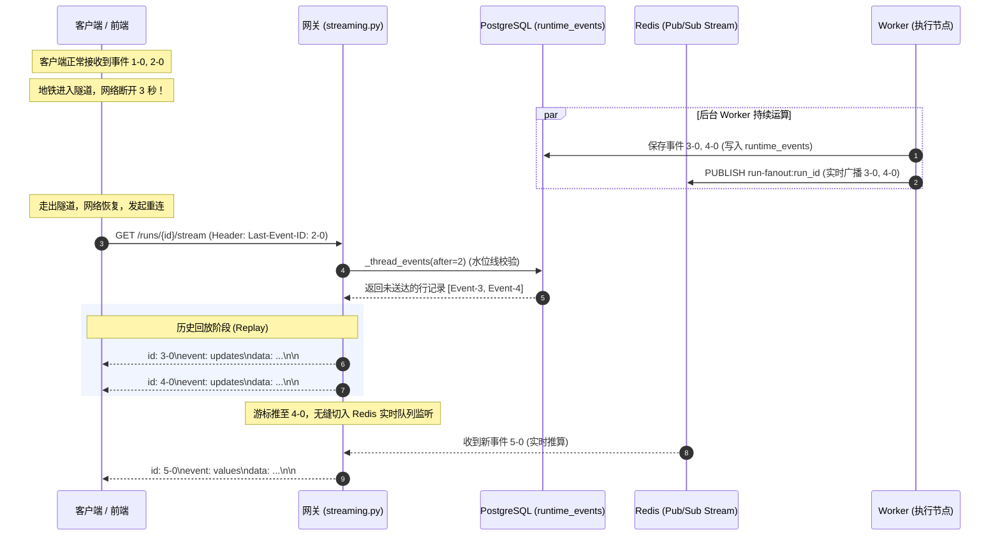

# 05-Graph 执行核、Run 状态机跃迁与 SSE 实时事件流

> **模块定位与核心价值**：本模块是 GraphHarbor 呈现给终端用户的**计算执行中枢与打字机流式通讯生命线**。它向上依托 `langhost.streaming` 构筑毫秒级低延迟、支持断线无感续传（Last-Event-ID）与反向代理保活心跳的 Server-Sent Events (SSE) 通道；向下依托 `langgraph_runtime_pg.graph_executor`，基于 LangGraph 原生 Typed Event Stream v3 协议驱动图执行，并以确定性有限状态机（DFSM）严密掌管智能体在运行、中断审批（Human-in-the-loop）、回滚与终态之间的原子跃迁。

---

## 零、知识前置与上下文串联（Knowledge Bridges）

### 1. 认知输入（前置输入与执行契约）
- **Worker 认领实体**：处于持有合法租约态的 [`RunRow`](file:///Users/lijiaxin/PyCharmMiscProject/graphharbor/libs/langgraph-runtime-pg/src/langgraph_runtime_pg/models.py)（包含 `input`, `config`, `stream_mode`, `kwargs`）；
- **动态图注册表实例**：[`GraphRegistry`](file:///Users/lijiaxin/PyCharmMiscProject/graphharbor/libs/langgraph-runtime-pg/src/langgraph_runtime_pg/graph_registry.py) 动态导出的 CompiledGraph，已附加 [`FencedPostgresSaver`](file:///Users/lijiaxin/PyCharmMiscProject/graphharbor/libs/langgraph-runtime-pg/src/langgraph_runtime_pg/checkpoint.py)；
- **网络流式握手头**：HTTP 请求头中的 `Last-Event-ID`（断线重连游标，格式如 `15-0`）与 `Accept: text/event-stream`。

### 2. 本章核心流转
- **图执行流式驱动（Graph Execution）**：[`graph_executor.invoke_graph`](file:///Users/lijiaxin/PyCharmMiscProject/graphharbor/libs/langgraph-runtime-pg/src/langgraph_runtime_pg/graph_executor.py) 调用 `graph.astream_events(version="v3")`，装配 `UpdatesTransformer`, `CustomTransformer`, `CheckpointsTransformer` 等切片器，逐帧捕获节点输出；
- **确定性状态机跃迁（Deterministic FSM）**：[`run_state.transition`](file:///Users/lijiaxin/PyCharmMiscProject/graphharbor/libs/langgraph-runtime-pg/src/langgraph_runtime_pg/run_state.py) 严格管控生命周期。执行中若检测到 `interrupts` 信号，立即跃迁为 `INTERRUPTED` 并落盘等待人类介入；执行完毕则原子推进至 `SUCCESS`，基础设施异常则触发自适应退避重试；
- **事件缓冲与双轨分发（Event Persistence & Fanout）**：Worker 通过 `EventBuffer` 将生命周期与步骤更新写入数据库 `runtime_events`（持久化溯源），同时向 Redis Pub/Sub `run-fanout` 频道实时广播；
- **SSE 网关游标重播与保活（Stream Generator）**：[`streaming.thread_stream`](file:///Users/lijiaxin/PyCharmMiscProject/graphharbor/libs/langhost/src/langhost/streaming.py) 接管长连接。先根据客户端 `Last-Event-ID` 从数据库查出断线期间缺失的事件进行补发，随后无缝切换至 Redis 内存队列监听实时事件，并在空闲期定时注入 `: heartbeat\n\n` 保活。

<details>
<summary>💡 <b>老王 30 秒原地折叠小拐杖：Human-in-the-loop 审批挂起与命令恢复</b>（点击展开）</summary>

> 1. **生活大白话类比**：就像去银行大额转账 500 万，柜员在系统里输入完信息后，系统弹出提示：“金额超限，请行长插卡审批（Interrupt）”。这时柜员的电脑绝对不会死机傻等，而是把单据挂起，柜员继续办下一个业务；行长来了刷卡授权（Resume），系统立刻调出原单据继续扣款！
> 2. **解决的生产痛点**：涉及高危操作（删库、转账）必须由人类确认。如果用简单的线程睡眠阻塞等待，Worker 进程和数据库连接会被死死占死，节点一重启审批单据彻底蒸发；状态机落盘解耦让系统在等待审批期间物理资源消耗为零。
> 3. **落地映射与传送门**：本项目在 [`run_state.py`](file:///Users/lijiaxin/PyCharmMiscProject/graphharbor/libs/langgraph-runtime-pg/src/langgraph_runtime_pg/run_state.py) 与 [`graph_executor.py`](file:///Users/lijiaxin/PyCharmMiscProject/graphharbor/libs/langgraph-runtime-pg/src/langgraph_runtime_pg/graph_executor.py) 的 `resume_command` 落地。深度源码解密直达专篇 👉 [01-复杂状态机：Human-in-the-loop 跃迁全景图](concepts/01-run-state-machine-and-interrupt.md)。

</details>

<details>
<summary>💡 <b>老王 30 秒原地折叠小拐杖：SSE 实时扇出与 Last-Event-ID 断线续传</b>（点击展开）</summary>

> 1. **生活大白话类比**：就像在地铁上看长篇连载小说，地铁进隧道断网了，你手里捏着书签（`Last-Event-ID: 第 88 页`）。列车一出隧道连上信号，网关立刻从第 89 页开始给你推送，你不需要从第一章重新翻起，大模型也不用重新花钱算一遍！
> 2. **解决的生产痛点**：移动端网络极易颠簸抖动。如果没有游标断线重播，用户只要网络卡顿 1 秒，打字机流式输出就彻底中断甚至报错；如果让大模型重新生成，Token 费用成倍暴增且可能产生重复副作用。
> 3. **落地映射与传送门**：本项目在 [`streaming.py`](file:///Users/lijiaxin/PyCharmMiscProject/graphharbor/libs/langhost/src/langhost/streaming.py) 落地。深度源码解密直达专篇 👉 [02-真实流式通信：SSE 事件扇出、Last-Event-ID 重播与保活心跳](concepts/02-sse-event-fanout-and-resume.md)。

</details>

### 3. 认知输出（支撑后续模块）
- 为终端前端与 LangSmith Studio 提供丝滑稳定的实时打字机输出；
- 为企业审计与监控体系留存不可篡改的 `RuntimeEventRow` 顺序事件日志。

---

## 一、对立视角：简易原型 vs 生产架构（Naive vs Production）

### 1. 核心维度演进与选型考量表

| 维度 | 简易原型方案 (Naive) | 生产级实现 (Production Reality) | 选型与演进考量 |
| :--- | :--- | :--- | :--- |
| **流式连接生命周期** | 将模型生成器（Generator）直接绑死在前端 HTTP 连接上，前端刷新页面推理直接被掐断。 | **计算与网络传输彻底解耦**：Worker 异步推 Redis + 入库，网关按需挂载监听。 | 前端无论是断网、关浏览器还是多端同时查看，Agent 后台计算均平稳运行。 |
| **断线重连与容错** | 不支持游标续传，断线重连后只能重新从头跑一遍推理（浪费 Token 且非幂等）。 | **支持官方 `Last-Event-ID` 游标**：数据库水位线回放 + Redis 实时无缝衔接。 | 确保网络抖动恢复后，客户端精确从上一个收到的事件帧开始无损拼装。 |
| **网关长连接保活** | 纯粹等待下游数据产出，遇到大模型思考或工具耗时较长，中途不发任何字节。 | **定时自动注入 `: heartbeat\n\n`**，并强制附加 `X-Accel-Buffering: no`。 | 彻底杜绝 Nginx、Cloudflare 或 AWS ALB 等反向代理在 60 秒无数据传输时强制掐线。 |
| **审批中断资源占用** | 采用阻塞等待（`while not approved: sleep`），进程与线程池一直被挂死霸占。 | **DFSM 状态机将 Run 推进至 `interrupted`**，保存快照并**当场释放 Worker 资源**。 | 集群可以支撑成千上万个长期挂起的审批流程，零额外 CPU 与内存浪费。 |

### 2. 20 行极简对立代码演示

```python
# ❌ 简易原型 (Naive Demo)：流式绑定进程 + 阻塞等待审批，脆弱易死
async def naive_stream(request: Request, graph, input_data):
    # 致命伤 1：把执行直接绑在 HTTP 循环里，客户端一断开连接，整场推理全部白费
    async for chunk in graph.stream(input_data):
        if is_sensitive_op(chunk):
            # 致命伤 2：线程休眠等待审批，Worker 槽位被卡死，机器瞬间资源枯竭
            while not check_human_approval():
                await asyncio.sleep(1)
        yield f"data: {chunk}\n\n"

# ✅ 生产级实现 (GraphHarbor Production)：解耦扇出 + 游标重播 + 状态机落盘挂起
async def thread_stream(request: Request):
    cursor = parse_last_event_id(request.headers.get("last-event-id"))
    # 守卫 1：先从 PostgreSQL 捞取断线期间被修剪水位线以上的历史事件
    watermark, missed_events = await fetch_events_since(thread_id, cursor)
    for event in missed_events:
        yield format_sse_frame(event)
    # 守卫 2：接入 Redis Pub/Sub 内存队列，无缝接收后续实时打字机 Token
    async for live_msg in subscribe_stream(thread_id):
        # 守卫 3：遇空闲期自适应发送 ": heartbeat\n\n"，防网关超时
        yield format_sse_frame(live_msg)
```

---

## 二、源码精准坐标映射（Code Pointer Map）

| 职责划分 | 核心代码路径 | 关键类 / 函数 / 契约入口 | 生产核心职责 |
| :--- | :--- | :--- | :--- |
| **SSE 端点控制器** | [`libs/langhost/src/langhost/streaming.py`](file:///Users/lijiaxin/PyCharmMiscProject/graphharbor/libs/langhost/src/langhost/streaming.py) | `thread_stream()`, `runs_stream()` | 接管客户端长连接、解析 `Last-Event-ID` 游标、下发保活心跳与事件流 |
| **历史事件回放仓储**| [`libs/langhost/src/langhost/streaming.py`](file:///Users/lijiaxin/PyCharmMiscProject/graphharbor/libs/langhost/src/langhost/streaming.py) | `_thread_events()`, `_thread_cursor()` | 结合水位线（watermark）从 `runtime_events` 提取断线缺失事件帧 |
| **图执行流式驱动** | [`libs/langgraph-runtime-pg/src/langgraph_runtime_pg/graph_executor.py`](file:///Users/lijiaxin/PyCharmMiscProject/graphharbor/libs/langgraph-runtime-pg/src/langgraph_runtime_pg/graph_executor.py) | `invoke_graph()`, `resume_command()` | 装配 Transformers 驱动 `astream_events(v3)`，将中断转化为恢复命令 |
| **确定性状态机** | [`libs/langgraph-runtime-pg/src/langgraph_runtime_pg/run_state.py`](file:///Users/lijiaxin/PyCharmMiscProject/graphharbor/libs/langgraph-runtime-pg/src/langgraph_runtime_pg/run_state.py) | `transition()`, `is_terminal()` | 维护 PENDING/RUNNING/INTERRUPTED/SUCCESS 确定性跃迁规则与基础设施重试 |
| **图注册中心** | [`libs/langgraph-runtime-pg/src/langgraph_runtime_pg/graph_registry.py`](file:///Users/lijiaxin/PyCharmMiscProject/graphharbor/libs/langgraph-runtime-pg/src/langgraph_runtime_pg/graph_registry.py) | `GraphRegistry` | 动态扫描 `langgraph.json`，延迟加载图拓扑并绑定生产级 Checkpointer |
| **持久化事件实体** | [`libs/langgraph-runtime-pg/src/langgraph_runtime_pg/models.py`](file:///Users/lijiaxin/PyCharmMiscProject/graphharbor/libs/langgraph-runtime-pg/src/langgraph_runtime_pg/models.py) | `RuntimeEventRow` | 单调自增序列号（`sequence`）、唯一终端事件约束与 JSONB 事件体持久化 |

---

## 三、真实数据结构与报文（Real Payloads & DB Schemas）

### 1. 真实 SSE 标准事件帧输出
客户端在监听 `POST /threads/{id}/runs/stream` 时接收到的标准报文流：

```text
id: 1-0
event: metadata
data: {"run_id":"7a3539a2-4a0b-47e9-a35f-14923e1136b8","attempt":1}

id: 2-0
event: updates
data: {"agent":{"messages":[{"content":"Thinking about user query...","type":"ai"}]}}

: heartbeat

id: 3-0
event: values
data: {"messages":[{"content":"Hello! How can I help you today?","type":"ai"}]}

id: 4-0
event: metadata
data: {"status":"run_done","run_id":"7a3539a2-4a0b-47e9-a35f-14923e1136b8"}
```
*(注：`: heartbeat` 为原生 SSE 注释行，客户端 EventSource 自动忽略，专用防代理切断连接)*

### 2. 审批恢复指令 Payload (`resume_command`)
当 Run 处于 `interrupted` 状态时，前端通过提交带有 `resume` 字段的指令恢复执行：

```json
{
  "command": {
    "resume": {
      "approved": true,
      "operator_id": "usr_admin_001",
      "override_reason": "Risk reviewed by security team."
    }
  }
}
```

在底层，系统通过 `resume_command()` 将其还原为原生 `langgraph.types.Command(resume=...)` 并精准唤醒挂起节点。

---

## 四、端到端函数级调用时序（Function-Level Trace）

下图展现客户端发生网络断连后，如何借助 `Last-Event-ID` 游标实现无损重连与无缝回放：



---

## 五、核心实现高保真伪代码（High-Fidelity Pseudocode）

以下伪代码提炼自 `streaming.py`，呈现历史回放与实时监听的无缝融合算法：

```python
# 剥离网络辅助，呈现游标断线续传与实时队列融合主逻辑
async def generate_resilient_sse_stream(request: Request, thread_id: UUID):
    # 1. 解析客户端传来的断点游标
    last_event_id = request.headers.get("Last-Event-ID")
    cursor_seq = parse_cursor_sequence(last_event_id)
    
    manager = get_stream_manager()
    local_queue = await manager.add_thread_stream(thread_id)
    heartbeat_interval = 15.0
    last_sent_at = current_time()
    
    try:
        initial_replay = True
        while True:
            # 2. 数据库历史溯源回放
            watermark, db_events = await fetch_events_after(thread_id, after_seq=cursor_seq)
            
            # 检查游标是否已被物理修剪（超期淘汰）
            if last_event_id and cursor_seq < watermark:
                yield format_sse_error("cursor_expired", recovery="fetch_full_state")
                return

            for row in db_events:
                cursor_seq = row.sequence
                yield format_sse_frame(row, event_id=f"{row.sequence}-0")
                last_sent_at = current_time()
            
            initial_replay = False
            
            # 3. 实时队列等待与自适应保活心跳注入
            remaining = max(0.1, heartbeat_interval - (current_time() - last_sent_at))
            try:
                msg = await asyncio.wait_for(local_queue.get(), timeout=remaining)
                # 收到实时消息，解包并下发
                yield format_sse_frame(msg, event_id=f"{msg.seq}-0")
                last_sent_at = current_time()
            except TimeoutError:
                if await request.is_disconnected():
                    return
                # 空闲超时，向通道注入注释行防止反向代理掐线
                yield ": heartbeat\n\n"
                last_sent_at = current_time()
    finally:
        await manager.remove_thread_stream(thread_id, local_queue)
```

---

## 六、假想断电与极限场景推演（Thought Experiments）

### 场景一：移动端网络在 4G/Wi-Fi 切换瞬间发生闪断
- **推演过程**：手机端在接收大模型流式输出时发生基站切换，TCP 连接断开 2 秒。随后前端利用原生 EventSource 机制自动重连，携带 `Last-Event-ID: 45-0`。
- **系统表现**：网关接收请求后，提取游标 `45`，直接从 `runtime_events` 表查询 `sequence > 45` 的记录；将中间丢失的第 46、47 帧瞬间补齐发送给前端，随后无缝衔接第 48 帧实时流；前端界面文字毫无卡顿或跳变，用户完全没有感知到曾经发生过断网。

### 场景二：云厂商反向代理（Cloudflare / ALB / Nginx）配置了 60 秒空闲超时
- **推演过程**：智能体在某一节点调用了一个超耗时的高清图像生成工具，工具执行耗时长达 90 秒，期间大模型没有产出任何文本。
- **系统表现**：网关检测到在过去 15 秒内没有任何数据帧发出，自动向长连接通道写入 `: heartbeat\n\n`。反向代理每隔 15 秒收到该字节流，确认底层连接依旧活跃，重置自身的 60 秒倒计时；90 秒后工具返回结果，正常推送，彻底杜绝了 504 Gateway Timeout 惨剧。

### 场景三：智能体触发敏感操作触发人工审批中断（HITL Interrupt）
- **推演过程**：智能体执行到“转账”节点，图节点返回 `interrupt("Confirm transfer of $50,000?")`。
- **系统表现**：
  1. `graph_executor` 捕获到中断对象，将 `RunRow.status` 更新为 `interrupted`，并在 `ThreadRow.interrupts` 中记录快照；
  2. 向流式通道发送 `event: metadata` 携带 `{"status": "run_done"}`，长连接优雅结束；
  3. Worker 进程完全退出并释放该任务的所有资源；
  4. 人类管理员在界面审批后，发送 `Command(resume={"confirmed": True})`，调度器唤醒新 Worker 从精确中断的 Checkpoint 节点继续执行。

---

## 七、架构不变量清单（Architectural Invariants）

在后续流式传输与状态机相关的任何重构中，必须死守以下三条红线规则：

1. **事件序列单调递增不变量（Event Sequence Monotonicity Invariant）**：
   每个 Thread 内派发的 `RuntimeEventRow.sequence` 必须严格保持单调递增，严禁出现乱序、序列号回跳或重复派发。
2. **反向代理零缓冲不变量（Zero-Buffering Header Invariant）**：
   所有暴露流式输出的 HTTP 响应头中，必须无条件携带 `Cache-Control: no-cache, no-transform` 与 `X-Accel-Buffering: no`，防止任何中间件缓冲打字机数据。
3. **中断挂起无状态驻留不变量（Stateless Interruption Invariant）**：
   当任务进入 `interrupted` 状态时，执行宿主必须彻底释放该任务的内存与租约，严禁在后台保持任何挂起协程或常驻进程等待人类输入！
