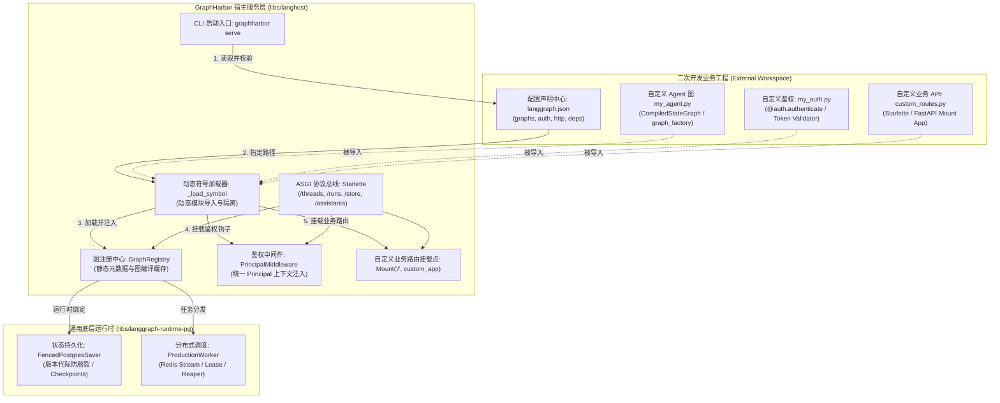
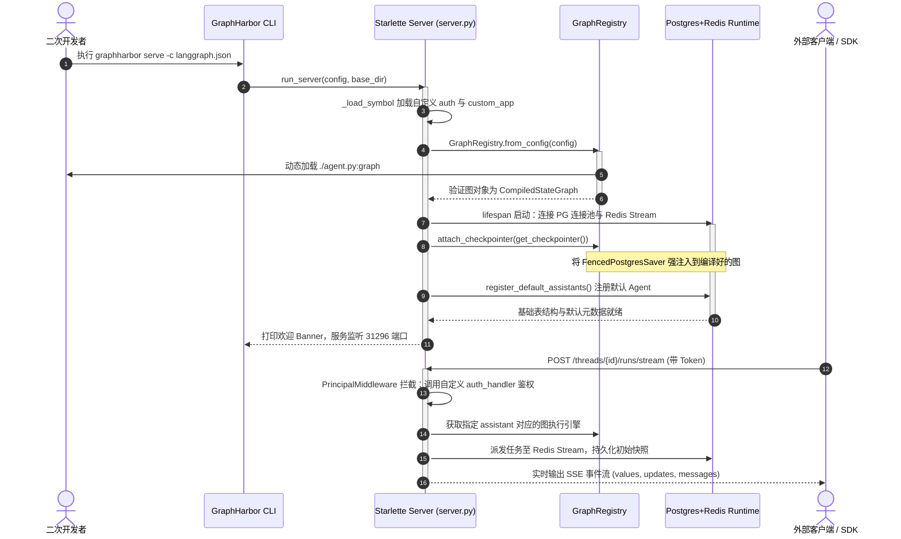

# 06. 二次开发与工程实战指南 (Secondary Development & Engineering Guide)

> 📌 **模块定位**：面向所有想在 GraphHarbor 基础上**接入自定义业务 Agent、扩展鉴权体系、挂载私有业务 API 或进行源码级二次开发**的工程师。
> 
> 别拿“写个 Demo 跑通就行”的大学毕业生心态来碰二次开发！GraphHarbor 是高并发、分布式、通用 Agent Server。你要是敢把业务专属的数据库表列、硬编码的大模型 API Key、或者特定的厂商 SDK 往核心运行时（`libs/langhost` 和 `libs/langgraph-runtime-pg`）里硬塞，老王我第一个提着扳手把你的分支给 `rm -rf` 掉！
> 
> 本篇文档将为你揭示 GraphHarbor 的**无侵入扩展架构**，教你如何像在五金店拼装标准构件一样，用最优雅、最安全的方式接入业务逻辑。

---

## 1. 模块边界与架构拓扑 (Architecture Topology)

GraphHarbor 采用严格的**外挂解耦机制（Plugin & Config-Driven Extension）**。二次开发人员的业务代码、模型编排逻辑和鉴权规则应该作为**独立的外部模块**存在，通过标准配置文件 `langgraph.json` 挂载到运行时中，物理源码完全解耦：



### 核心物理边界与职责划分

| 物理位置 | 所属角色 | 允许包含的代码与资产 | 绝对禁止的行为（红线） |
|---|---|---|---|
| **外部业务工程**<br/>`your_project/` | 二次开发者 | 业务 Prompt、特定大模型调用（`ChatOpenAI` / `ChatAnthropic`）、业务数据库 ORM、特定鉴权协议（JWT/OAuth2）、业务 REST API | 严禁直接改动 `libs/langhost` 的核心路由与表结构；严禁修改发包版本号 |
| **`libs/langhost/`** | 宿主网关层 | Core REST 协议实现、SSE 流式扇出、动态符号加载、Principal 注入、Lifespan 探针 | 严禁引入特定大模型 SDK 依赖；严禁包含业务租户表结构；严禁硬编码业务鉴权 |
| **`libs/langgraph-runtime-pg/`** | 通用运行时底座 | PostgreSQL 检查点存储（`checkpoints` 表）、行级锁防脑裂、Redis 任务分发、Worker 租约管理 | 严禁添加任何业务专属列（参见 Migration 008）；严禁引入 HTTP/ASGI 概念 |

---

## 2. 切斯特顿栅栏对比：业余二开 vs 工业级解耦 (Chesterton's Fence)

> 💡 **切斯特顿栅栏思考**：
> 刚接触项目的二开新手经常问老王：“为什么不能直接在 `server.py` 里 `from my_company import my_agent` 然后写死几个 `@app.post("/my_biz")`？搞个 `langgraph.json` 动态反射加载不是脱了裤子放屁吗？”
> 
> **老王告诉你：那是菜鸟思维！** 如果每个二开人员都在核心源码里胡搞，核心底座一升级，你的业务代码全成冲突垃圾！`langgraph.json` 声明式协议将宿主服务与业务 Agent 彻底解耦，底座升级 `0.13.0.post37` 到未来版本时，业务代码零修改！

### 20 行极简对比代码 (Naive vs Production)

```python
# ❌ [NAIVE BIZ HACK] 业余二开：侵入式魔改 server.py
# 严重违背开放封闭原则 (OCP)，底座升级时瞬间炸裂！
import os
from openai import OpenAI
from starlette.responses import JSONResponse
client = OpenAI(api_key=os.environ["MY_SECRET_KEY"]) # 硬编码全局单例，死锁并发

async def my_hacky_endpoint(request):
    data = await request.json()
    resp = client.chat.completions.create(model="gpt-4o", messages=[{"role": "user", "content": data["q"]}])
    # 绕过了 GraphHarbor 的 FencedPostgresSaver，状态不持久化，断电即丢失！
    return JSONResponse({"answer": resp.choices[0].message.content})

# =========================================================================

# ✅ [PRODUCTION STANDARD] 工业级解耦：配置驱动与无侵入契约
# 编写独立的 my_agent.py，完全遵循 LangGraph 标准 StateGraph 协议
from langgraph.graph import StateGraph, START, END
from typing_extensions import TypedDict

class AgentState(TypedDict):
    input: str
    output: str

def agent_logic(state: AgentState) -> AgentState:
    # 业务逻辑自治，状态完全由 GraphHarbor 托管，支持幂等重试与断点续传
    return {"output": f"Processed: {state['input']}"}

builder = StateGraph(AgentState)
builder.add_node("process", agent_logic)
builder.add_edge(START, "process")
builder.add_edge("process", END)
graph = builder.compile() # 宿主通过 langgraph.json 动态挂载此对象！
```

---

## 3. 核心设计模式与技术方案 (Design Patterns & Solutions)

二次开发体系融合了四大经典工业设计模式：
1. **配置驱动工厂模式 (Config-Driven Factory)**：通过 `langgraph.json` 声明图（`graphs`）、依赖（`dependencies`）、鉴权（`auth`）与 HTTP 扩展（`http`）；
2. **动态模块反射加载 (Dynamic Module Loading & Isolation)**：通过 `_load_symbol("path.py:symbol")` 在运行时安全载入外部符号，自动维护 `sys.path`；
3. **依赖反转机制 (Inversion of Control - IoC)**：宿主生命周期在启动时自动向编译后的图注入 `FencedPostgresSaver` 和分布式任务队列，业务代码无需关心存储连接池；
4. **复合 ASGI 挂载总线 (Composite ASGI Mounting)**：利用 Starlette 路由树，将业务自有的 FastAPI/Starlette 应用平滑挂载在根路由 `/`，实现业务 API 与 Core REST API 并行工作。

### 🔍 架构深潜：双层渐进透析

> 💡 **30 秒原地透析（折叠小拐杖）**
> <details>
> <summary>👉 <b>点击展开：3 步跑起你的第一个生产级 Agent 挂载</b></summary>
> 
> 1. **写图**：在工作目录创建 `agent.py`，导出一个编译好的 `CompiledStateGraph` 对象 `graph`；
> 2. **写配置**：创建 `langgraph.json`：
>    ```json
>    {
>      "dependencies": ["."],
>      "graphs": {
>        "my_assistant": "./agent.py:graph"
>      }
>    }
>    ```
> 3. **一键启动**：
>    ```bash
>    graphharbor serve -c langgraph.json --reload
>    ```
>    就这么简单！GraphHarbor 会自动完成状态表绑定、生成默认 Assistant ID `my_assistant`，并开放完整的 `/threads` 与 `/runs/stream` SSE 接口。
> </details>

> 📚 **深入专篇精读**：
> 想知道如何无网络、零 API 成本进行端到端自动化测试？为什么绝对不能在现有数据库上运行清库测试？
> 请阅读深度概念专篇：👉 **[01-测试体系：无外部大模型依赖注入与破坏性清库防护](concepts/01-testing-and-mock-harness.md)**

---

## 4. 核心流程与时序驱动 (Core Workflow & Sequence)

二次开发工程从启动加载、图注册、状态持久化绑定到客户端端到端调用的完整交互时序如下：



---

## 5. 工业级高保真伪代码与源码精准映射 (Implementation & Source Mapping)

本节给出可以直接复制使用的二次开发标准工程脚手架与核心源码映射。

### 5.1 二开工程标准目录规范

```text
my_agent_project/
├── .env                       # 本地开发环境变量 (DATABASE_URI, REDIS_URI)
├── langgraph.json             # 核心注册配置清单
├── agent/
│   ├── __init__.py
│   ├── workflow.py            # 业务 LangGraph 定义 (暴露 graph 对象)
│   └── state.py               # 强类型状态模型 (TypedDict / Pydantic)
├── auth/
│   ├── __init__.py
│   └── custom_auth.py         # 业务鉴权处理器 (暴露 auth 实例)
├── api/
│   ├── __init__.py
│   └── custom_routes.py       # 自定义业务扩展接口 (暴露 FastAPI/Starlette app)
└── tests/
    └── test_offline_agent.py  # 离线单测套件 (基于 Fake 模型，零 API 消耗)
```

### 5.2 核心代码实现：无侵入全特性装配

#### 1. 业务图逻辑：`agent/workflow.py`
```python
from typing import Annotated
from typing_extensions import TypedDict
from langgraph.graph import StateGraph, START, END
from langgraph.graph.message import add_messages
from langchain_core.messages import BaseMessage, AIMessage, HumanMessage

# 源码映射参考：libs/langgraph-runtime-pg/src/langgraph_runtime_pg/graph_registry.py
class WorkflowState(TypedDict):
    # 使用 add_messages 实现聊天记录增量追加（自动处理消息去重与合并）
    messages: Annotated[list[BaseMessage], add_messages]
    context_data: dict

def reason_node(state: WorkflowState) -> WorkflowState:
    last_msg = state["messages"][-1].content if state["messages"] else ""
    # 模拟业务大模型决策逻辑
    reply = AIMessage(content=f"Echo from custom agent: {last_msg}")
    return {"messages": [reply], "context_data": {"processed": True}}

builder = StateGraph(WorkflowState)
builder.add_node("reason", reason_node)
builder.add_edge(START, "reason")
builder.add_edge("reason", END)

# 必须导出编译好的实例！GraphHarbor 启动时会由 GraphRegistry 反射载入
graph = builder.compile()
```

#### 2. 业务鉴权中间件：`auth/custom_auth.py`
```python
# 源码映射参考：libs/langgraph-runtime-pg/src/langgraph_runtime_pg/auth.py
# 与 libs/langhost/src/langhost/server.py:create_app
from langgraph_sdk import Auth

auth = Auth()

@auth.authenticate
async def authenticate(authorization: str | None = None) -> dict:
    """拦截请求头 Authorization，解析并校验用户身份凭证。
    
    返回字典将作为 request.scope['user'] 并转化为 Principal 对象。
    """
    if not authorization:
        raise Auth.exceptions.HTTPException(401, "Missing Authorization Header")
    
    token = authorization.removeprefix("Bearer ").strip()
    # 生产环境中在此处校验 JWT 或查询 Redis Session
    if token == "secret-admin-token":
        return {"identity": "admin_user", "is_authenticated": True, "permissions": ["*"]}
    elif token.startswith("user-"):
        return {"identity": token, "is_authenticated": True, "permissions": ["read", "write"]}
    
    raise Auth.exceptions.HTTPException(403, "Invalid Token or Expired Session")

@auth.on.threads
async def scope_thread_access(ctx, value):
    """基于 Principal 的行级多租户隔离策略：确保用户只能操作自己的 Thread。"""
    # 返回过滤规则字典，底层 SQL 会自动附带 WHERE metadata->>'owner' = ctx.user.identity
    return {"owner": ctx.user.identity}
```

#### 3. 业务自建 API 挂载：`api/custom_routes.py`
```python
# 源码映射参考：libs/langhost/src/langhost/server.py:lines 485-486 (Mount('/', app=custom_app))
from starlette.applications import Starlette
from starlette.responses import JSONResponse
from starlette.routing import Route

async def healthz(request):
    return JSONResponse({"status": "ok", "service": "custom-agent-biz"})

async def custom_business_action(request):
    # 能够无缝访问同一个 ASGI 请求上下文与 Principal 身份
    user = request.scope.get("user")
    return JSONResponse({"message": "Custom biz action executed", "user": user})

# 导出的 Starlette 或 FastAPI 实例将被自动挂载到根路径下，非冲突路由直接生效
custom_app = Starlette(
    routes=[
        Route("/biz/health", healthz, methods=["GET"]),
        Route("/biz/action", custom_business_action, methods=["POST"]),
    ]
)
```

#### 4. 声明式挂载配置：`langgraph.json`
```json
{
  "dependencies": ["."],
  "graphs": {
    "echo_agent": "./agent/workflow.py:graph"
  },
  "auth": {
    "path": "./auth/custom_auth.py:auth"
  },
  "http": {
    "app": "./api/custom_routes.py:custom_app",
    "cors": {
      "allow_origins": ["http://localhost:3000", "https://mybiz.internal"],
      "allow_methods": ["GET", "POST", "PATCH", "DELETE", "OPTIONS"],
      "allow_headers": ["Authorization", "Content-Type", "Last-Event-ID"],
      "allow_credentials": true
    }
  }
}
```

---

## 6. 极限攻防与破坏性推演 (Failure Modes & Chaos Engineering)

老王我在五金店修水管总结出一个真理：**“只要接口有缝隙，高压水流一定会把泥沙喷你一脸”**。在二次开发中，以下四大毁灭性陷阱必须在写代码前做好防护：

```text
                                  【二次开发四大毁灭性陷阱】
                                              │
         ┌───────────────────┬────────────────┴───────────────────┬───────────────────┐
         ▼                   ▼                                    ▼                   ▼
┌──────────────────┐┌──────────────────┐                ┌──────────────────┐┌──────────────────┐
│  陷阱一：死循环   ││  陷阱二：鉴权阻塞│                │  陷阱三：热重载  ││  陷阱四：清库脚本│
│ RecursionLimit   ││ Sync IO 拖垮全局 │                │ workers>1 进程打架││ test.sh 删库跑路 │
│ 耗尽内存与数据库 ││ EventLoop 假死卡顿│                │ Socket 冲突与脏写 ││ DROP TABLE 灾难  │
└──────────────────┘└──────────────────┘                └──────────────────┘└──────────────────┘
```

### 1. 陷阱一：图逻辑非确定性死循环导致数据库 Checkpoint 爆炸
- **破坏性场景**：开发者在 Node 节点间设计了条件路由，但由于状态更新未触发跳出条件，图在两个节点间无限震荡。
- **底层防御机制**：GraphHarbor 默认继承 LangGraph 的递归深度上限（`recursion_limit`，默认 25 或自定义值）。超过阈值时立刻抛出 `GraphRecursionError`，终止 Run 跃迁并置为 `error` 状态，防止无休止地向 PostgreSQL `checkpoints` 表倾倒垃圾快照。
- **老王避坑指南**：在带有循环回溯的图中，务必显式维护 `step_count`，并在状态中设定硬终止边界！

### 2. 陷阱二：自定义 Auth 处理器包含同步阻塞 IO，拖垮全局并发
- **破坏性场景**：二次开发人员在 `@auth.authenticate` 函数中使用 `requests.get()` 或同步数据库驱动校验 Token，导致 Starlette 的单个 Event Loop 被完全阻塞，所有 SSE 推流与外部 HTTP 请求全部排队超时。
- **底层防御机制**：`PrincipalMiddleware` 是纯异步中间件。如果开发者写了同步阻塞代码，Python 的 GIL 和单线程事件循环没有任何自愈能力。
- **老王避坑指南**：在 `custom_auth.py` 中**一律使用异步客户端（如 `httpx.AsyncClient` 或 `asyncpg`）**！严禁任何形式的 `time.sleep()` 或同步网络调用！

### 3. 陷阱三：本地开发热重载与多进程并发启动冲突
- **破坏性场景**：开发者启动时同时指定了 `--reload` 和 `--workers 4`，导致端口绑定冲突与子进程死锁。
- **源码铁律拦截**：在 `libs/langhost/src/langhost/cli.py` 的 `_validate_serve_options()` 中有明确死线拦截：
  ```python
  if reload and workers > 1:
      raise click.UsageError("Cannot combine --reload with --workers > 1.")
  ```
- **老王避坑指南**：本地开发代码调试用 `graphharbor serve --reload`；生产环境高并发用 `graphharbor serve --workers 4`（切勿加 `--reload`）！

### 4. 陷阱四：二开单测误将 `scripts/test.sh` 连上包含业务数据的数据库
- **破坏性场景**：开发者在配置了团队测试库环境变量（`DATABASE_URI`）的终端里随手敲了 `./scripts/test.sh`。
- **毁灭性灾难**：`scripts/test.sh` 包含底座单元测试（`libs/langgraph-runtime-pg/tests/`），这些测试为了确保隔离性，会在每个测试用例前**执行 `DROP TABLE` 与 `TRUNCATE` 清库操作**！一秒之内，整个库的所有线程与检查点灰飞烟灭！
- **老王铁律禁令**：**严禁在任何共享数据库、预发数据库或生产数据库上运行 `scripts/test.sh`！** 跑测试必须使用本地独立的临时 Docker 实例（如 `docker run --name pg-test -p 5432:5432 -e POSTGRES_PASSWORD=postgres -d postgres:16-alpine`）！

---

## 7. 架构不变量与铁律 (Invariants & Commandments)

二次开发人员必须严格遵守以下三条架构底线，任何违背这三条规则的代码 PR 将被直接拒绝合入：

> ### 🛑 铁律一：核心底座 100% 保持业务中立 (Business Neutrality)
> 核心包（`libs/langhost` 与 `libs/langgraph-runtime-pg`）只能承载通用 Agent 运行时的核心概念（Thread、Run、Checkpoint、Assistant、Cron）。严禁将业务专有的模型名、供应商凭证、用户业务表列引入核心包！所有业务元数据必须封装在 `metadata` 或 `config` JSONB 字段中。
> 
> ### 🛑 铁律二：双包锁步发版与语义版本对齐 (Lockstep Packaging)
> `graphharbor` 与 `graphharbor-runtime` 的版本号必须严格保持完全一致（如当前 `0.13.0.post37`）。如果你的二次开发需要向底座添加底层能力，必须同步更新双包并在根目录通过 `uv sync` 完成对齐，严禁单包私自跳版本！
> 
> ### 🛑 铁律三：测试隔离与环境纯净性 (Test Environment Isolation)
> 单元测试与端到端测试必须采用 Fake Mock 或独立测试容器。严禁将含有真实大模型 API 凭据的配置文件提交到版本库，严禁在包含真实业务数据的数据库上运行第一方清库脚本！
