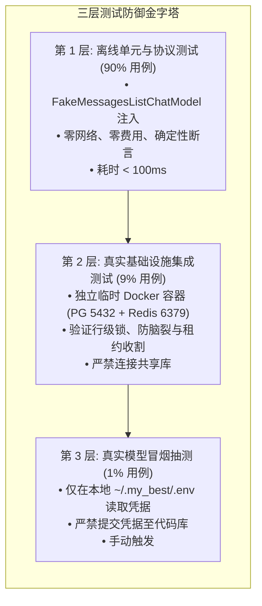
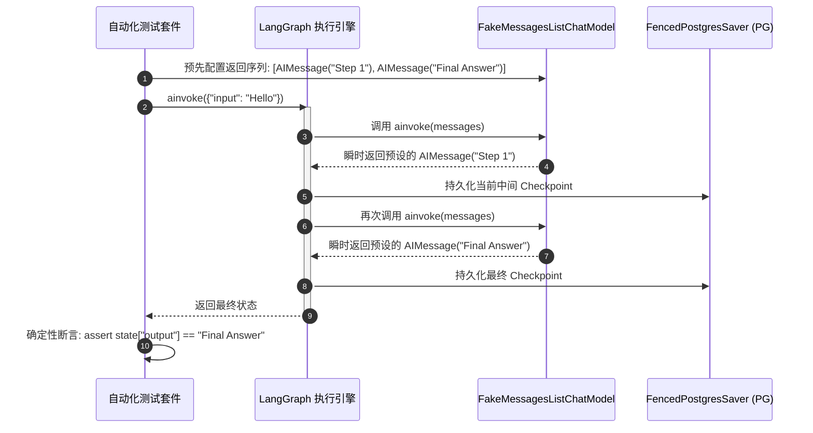

# 01. 测试隔离体系：无外部大模型依赖注入与破坏性清库防护 (Testing & Mock Harness)

> 📌 **专篇定位**：深入剖析 GraphHarbor 的工业级自动化测试架构。
> 
> 很多写 Agent 系统的工程师有个极其恶劣的坏毛病：每次跑测试都去调真实的 OpenAI / Anthropic API，跑一次测试花几毛钱美元不说，一旦遇到网络抖动或者厂商 429 限流，单测红得跟猴屁股一样，还美其名曰“不可抗力”！更有甚者，把清库脚本直接往共享数据库上一怼，同事辛苦搭的环境瞬间灰飞烟灭！
> 
> 老王今天就带你把 GraphHarbor 的**无模型依赖注入（Mock Harness）**与**破坏性清库防护机制（Destructive Cleanup Guard）**彻底剖析清楚，教你如何在 100% 离线、零 API 成本、亚秒级响应的前提下，完成高保真端到端测试！

---

## 1. 产生背景与历史教训 (Background & Hard Lessons)

在传统的 Agent 系统与服务开发中，测试环境通常面临两大致命痛点：

```text
               传统 Agent 测试的两大致命噩梦
                             │
        ┌────────────────────┴────────────────────┐
        ▼                                         ▼
【噩梦一：真实大模型外部依赖】             【噩梦二：测试污染与清库灾难】
  • 计费黑洞：CI 每日千次运行烧光经费       • 脚本内嵌 DROP TABLE / TRUNCATE
  • 偶发 Flaky：网络抖动 / 429 限流         • 误连共享/生产库瞬间造成数据灭顶
  • 不确定性：模型输出非受控导致断言偶发失败 • 连接池占用与 DDL 锁死引发超时
```

### 1. 真实大模型的非确定性与偶发失败 (Flaky Tests)
大语言模型的输出天然具有概率性。哪怕将 `temperature` 设为 0，底层算子浮点舍入差异也会导致输出微小漂移。如果在 CI 流水线中使用真实大模型断言严格的 JSON Schema 或特定回复，流水线失败率居高不下。同时，CI 并发拉起 10 个测试容器瞬间打满厂商 TPM（Tokens Per Minute）配额，导致大量 HTTP 429 Rate Limit 报错。

### 2. 测试清库逻辑引发的灭顶之灾
GraphHarbor 的底层状态机（`libs/langgraph-runtime-pg`）极度依赖真实 PostgreSQL 的事务隔离性、行级锁（`SELECT FOR UPDATE`）和代际自增。内存中的 sqlite 无法模拟真实的并发竞争。因此，单元测试必须在真实的 PostgreSQL 实例上运行。
为了确保每个单测用例之间的强隔离，测试套件会在 Setup/Teardown 阶段**执行 `TRUNCATE` 或 `DROP TABLE`**！如果开发者本地终端的环境变量 `DATABASE_URI` 误配成了团队共用的开发库甚至预发库，执行测试将瞬间摧毁所有数据！

---

## 2. 核心架构拓扑与交互时序 (Architecture & Sequence)

GraphHarbor 确立了**分层测试隔离架构**：绝大多数单元测试与协议测试必须在 100% 离线的 Fake 模型下运行；仅在最终发版验收时才允许读取本地安全凭据进行端到端抽样。



### Fake 模型时序交互：绝对可预测的执行流

通过在图定义中注入 `FakeMessagesListChatModel`，开发者预先设定好大模型的返回响应序列，完全绕过网络通信，实现微秒级状态跃迁：



---

## 3. 工业级代码实战与落地范式 (Production Implementation)

### 3.1 离线确定性图定义：`FakeMessagesListChatModel`

参考 `tests/acceptance_app/graphs.py` 的工业级实现范式，在构建 Agent 图时支持模型依赖注入：

```python
"""业务 Agent 的确定性测试实现范式。"""
from __future__ import annotations
from typing import Annotated
from typing_extensions import TypedDict
from langgraph.graph import StateGraph, START, END
from langgraph.graph.message import add_messages
from langchain_core.messages import BaseMessage, AIMessage, HumanMessage
from langchain_core.language_models.fake_chat_models import FakeMessagesListChatModel

class ChatState(TypedDict):
    messages: Annotated[list[BaseMessage], add_messages]

def build_agent_graph(llm=None):
    """通过工厂模式允许在测试中注入 Fake 模型，生产中注入真实模型。"""
    if llm is None:
        # 测试默认使用 Fake 模型：按调用顺序确定性返回预设内容
        llm = FakeMessagesListChatModel(
            responses=[
                AIMessage(content="[Mock] 我是离线测试助手，收到指令。"),
                AIMessage(content="[Mock] 处理完毕，任务完成。")
            ]
        )

    def call_model(state: ChatState) -> ChatState:
        response = llm.invoke(state["messages"])
        return {"messages": [response]}

    builder = StateGraph(ChatState)
    builder.add_node("agent", call_model)
    builder.add_edge(START, "agent")
    builder.add_edge("agent", END)
    return builder.compile()

# 导出供外部使用的测试图实例
offline_test_graph = build_agent_graph()
```

### 3.2 离线单元测试用例：确定性断言与性能压测

```python
"""基于 pytest 的纯离线集成单测。"""
import pytest
from langchain_core.messages import HumanMessage
from agent.workflow import build_agent_graph
from langchain_core.language_models.fake_chat_models import FakeMessagesListChatModel
from langchain_core.messages import AIMessage

@pytest.mark.asyncio
async def test_agent_deterministic_flow():
    # 1. 显式组装具有确定性响应序列的 Fake 模型
    mock_llm = FakeMessagesListChatModel(
        responses=[
            AIMessage(content="Plan A"),
            AIMessage(content="Execute A"),
            AIMessage(content="Summary A"),
        ]
    )
    graph = build_agent_graph(llm=mock_llm)

    # 2. 第一次调用
    res1 = await graph.ainvoke({"messages": [HumanMessage(content="Start")]})
    assert res1["messages"][-1].content == "Plan A"

    # 3. 再次调用，严格按队列吐出第二条，100% 确定，断言永不偶发翻车！
    res2 = await graph.ainvoke({"messages": [HumanMessage(content="Next")]})
    assert res2["messages"][-1].content == "Execute A"
```

### 3.3 数据库防清库安全守卫 (Database Safety Guard)

为了彻底杜绝 `scripts/test.sh` 或单元测试把开发库清空的惨剧，二次开发工程应在 `conftest.py` 中引入强效防爆断言：

```python
"""conftest.py - 测试数据库安全门禁，防止误删非隔离数据。"""
import os
import pytest
from urllib.parse import urlparse

PROTECTED_HOSTS = {"prod.db.internal", "staging.db.internal", "dev.shared.internal"}
PROTECTED_DB_NAMES = {"graphharbor_prod", "graphharbor_staging", "business_core"}

@pytest.fixture(scope="session", autouse=True)
def guard_test_database():
    """在测试会话开始前，强力校验 DATABASE_URI 是否为安全的隔离环境。"""
    uri = os.environ.get("DATABASE_URI", "")
    if not uri:
        pytest.fail("❌ DATABASE_URI 环境变量未设置，拒绝运行破坏性测试！")

    clean_uri = uri.replace("postgresql+asyncpg://", "postgresql://")
    parsed = urlparse(clean_uri)

    # 1. 检查主机名：严禁包含保护域名
    if parsed.hostname in PROTECTED_HOSTS:
        pytest.fail(f"🚨 严重警告！检测到测试正在尝试连接受保护的数据库主机: {parsed.hostname}！测试已强行熔断！")

    # 2. 检查数据库名：必须显式包含 test 标识，或严禁为生产库名
    db_name = parsed.path.lstrip("/")
    if db_name in PROTECTED_DB_NAMES or not (db_name.endswith("_test") or db_name == "langgraph"):
        pytest.fail(
            f"🚨 严重警告！测试目标数据库 '{db_name}' 未包含 '_test' 安全后缀或白名单！"
            "为防止误执行 TRUNCATE/DROP TABLE，测试已强制熔断！"
        )
```

---

## 4. 边界陷阱与老王避坑指南 (Edge Cases & Gotchas)

```text
                                  【测试体系三大避坑指南】
                                              │
         ┌────────────────────────────────────┼────────────────────────────────────┐
         ▼                                    ▼                                    ▼
┌────────────────────────────────┐   ┌────────────────────────────────┐   ┌────────────────────────────────┐
│  陷阱一：连接池与 DDL 死锁      │   │  陷阱二：Event Loop 跨线程污染  │   │  陷阱三：凭据明文泄漏入库      │
│ Server 占着连接，测试 TRUNCATE │   │ asyncio.run 导致连接池对象绑定失效│   │ 真实 API Key 意外提交至 Git   │
│ 引发 Postgres 独占锁排队永久僵死 │   │ 触发 RuntimeError: attached... │   │ 触发凭据泄露告警与经济损失     │
└────────────────────────────────┘   └────────────────────────────────┘   └────────────────────────────────┘
```

### 1. 陷阱一：Server 进程占着数据库连接时，测试套件执行 TRUNCATE 发生死锁
- **现象**：运行 `./scripts/test.sh` 时，整个脚本卡在某个测试用例 300 秒直到超时被 Watchdog 杀掉。
- **深层原因**：API Server 进程在后台跑着，并且连接池中有活动的连接持有表上的共享锁（`ACCESS SHARE`）。此时前台的单元测试尝试执行 `TRUNCATE TABLE runs`（需要排他的 `ACCESS EXCLUSIVE` 锁），PostgreSQL 会把 TRUNCATE 请求挂起排队，后续 API Server 的任何查询也会被堵塞，形成分布式死锁！
- **老王源码铁律**：仔细看 `scripts/test.sh` 源码第 151-153 行的红线注释：
  ```bash
  # Runtime tests truncate PG tables — must not run while the API server holds
  # connections to the same DB (that deadlocks truncate / claim).
  ```
  **必须先跑完清库的 unit/queue 测试，再启动 API Server 进程！** 绝不能让两者同时对同一个测试数据库进行操作！

### 2. 陷阱二：Asyncpg 连接池与 asyncio.run() 跨 Event Loop 污染
- **现象**：测试抛出 `RuntimeError: Task <Task-xxx> got Future <Future-xxx> attached to a different loop`。
- **深层原因**：在异步测试中，如果在 pytest fixture 外部随手写了 `asyncio.run()` 创建了底层连接池（`asyncpg.Pool`），该池会与当前的 Event Loop 绑定。随后 pytest-asyncio 在新的 loop 中复用该连接池时，底层 Socket 读写直接崩溃。
- **老王避坑指南**：全局只使用 `pytest-asyncio` 的 `event_loop` fixture 或将测试夹具作用域设为 `function`，严禁在异步代码中混用手动 `asyncio.run()`！

### 3. 陷阱三：为了省事在配置文件中硬编码大模型 API Key 导致密钥泄露
- **现象**：把包含 `OPENAI_API_KEY=sk-xxxx` 的 `langgraph.json` 或 `.env` 提交到了 GitHub 开源仓库。
- **老王痛骂**：写代码带点脑子！在五金店哪怕一把螺丝刀都得挂工具板上，你怎么敢把家里大门钥匙直接贴大街电线杆上？
- **老王铁律禁令**：
  1. 所有测试必须优先走 `FakeMessagesListChatModel`，做到完全脱敏；
  2. 真实大模型验收凭据只允许放置在宿主机外部的安全目录（如 `~/.my_best/.env`），在脚本启动时作为临时环境变量动态注入，**严禁**复制或软链接进代码仓库目录！
