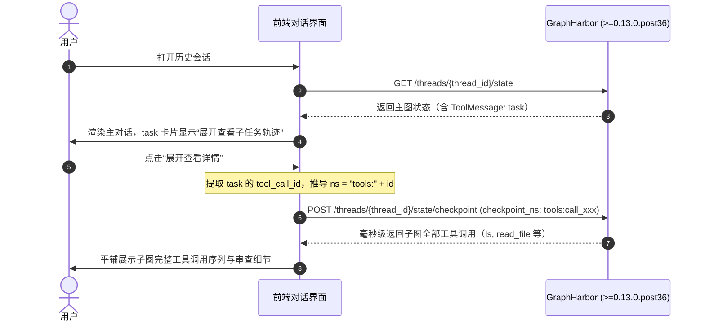

# AI Agent Platform 接入指引：子智能体（Subagent）执行轨迹与历史读取

- **文档编号：** RFC-20260928-GH-RESPONSE
- **适用版本：** GraphHarbor `>= 0.13.0.post36`
- **对应提案：** `RFC-20260928-GH-SUBAGENT-HISTORY`
- **面向对象：** AI Agent Platform 平台研发团队、前端工程团队

---

## 1. 架构评估与方案选型答复

首先，GraphHarbor 核心团队确认：**平台方指出的“持久化与历史回放中子智能体工具调用丢失”痛点 100% 真实。** 底层 PostgreSQL 数据库（`checkpoints` 与 `checkpoint_blobs` 表）实际上完整保存了每个子命名空间（`tools:<call_id>`）的全部消息与工具数据，此前无法拉取是由于 GraphHarbor REST 状态层遗漏了 `checkpoint_ns` 参数透传。

针对平台方提出的两个建议方案，核心团队的评估结论如下：

### 1.1 为什么坚决驳回方案 1（`expand_subagents=true` 全量聚合）？
1. **契约合规与标准破坏**：GraphHarbor 核心原则是对齐 LangGraph 官方 OpenAPI 和 Python/JavaScript SDK 契约。官方 `ThreadState` 模型并无 `subagents` 顶层字典，私有魔改会导致通用 SDK 反序列化失败或类型冲突。
2. **拒绝硬编码业务假设**：方案 1 强依赖 `LIKE 'tools:%'` 与 `trigger_call_id`。通用的 Agent Server 运行时不得假设上层 Tool 的命名空间规范，必须保持通用性。
3. **大 Payload 与内存雪崩**：复杂的 Multi-agent 任务往往包含数十次子智能体工具调用和数百条消息。若在每次刷新页面时全量 Dump 所有子图数据，单次请求响应体积可能暴增至数十 MB，引发 N+1 大 Blob 解包卡顿和服务端内存剧烈抖动。
4. **缺失历史溯源能力**：方案 1 无法覆盖 `threads_history`，平台未来无法支持子智能体步进时光倒流与历史节点审计。

### 1.2 为什么采纳并增强方案 2（标准 `checkpoint_ns` 路由支持）？
- **100% 官方标准**：完全对齐官方 `langgraph-sdk` 的标准调用方法：
  - `client.threads.get_state(thread_id, checkpoint={"checkpoint_ns": ...})`
  - `client.threads.get_history(thread_id, checkpoint={"checkpoint_ns": ...})`
- **动态 Subgraph 深度优化**：GraphHarbor 服务端针对 Tool 内部动态派生子图做了智能分流，绕过 LangGraph 主图静态拓扑校验，直接由高性能 PostgreSQL Checkpointer 解析，单次状态读取在毫秒级以内。

---

## 2. 接口契约规范

### 2.1 获取指定子智能体最新状态 (State)

#### 推荐方式：POST 端点（对齐官方 SDK）
```http
POST /threads/{thread_id}/state/checkpoint
Content-Type: application/json

{
  "checkpoint": {
    "checkpoint_ns": "tools:89b00bd9-03c0-6b3a-4dc0-566fe060a451"
  }
}
```

#### 便捷方式：GET Query 端点
```http
GET /threads/{thread_id}/state?checkpoint_ns=tools:89b00bd9-03c0-6b3a-4dc0-566fe060a451
```

#### 响应体（标准 `ThreadState`）：
```json
{
  "values": {
    "messages": [
      {
        "type": "human",
        "content": "investigate repository"
      },
      {
        "type": "ai",
        "name": "research",
        "tool_calls": [
          { "name": "ls", "args": { "path": "." } },
          { "name": "read_file", "args": { "path": "main.py" } }
        ]
      },
      {
        "type": "tool",
        "name": "ls",
        "content": "main.py\nconfig.yaml"
      },
      {
        "type": "tool",
        "name": "read_file",
        "content": "def main(): pass"
      },
      {
        "type": "ai",
        "content": "audit completed successfully"
      }
    ]
  },
  "next": [],
  "checkpoint": {
    "thread_id": "fba64a6c-0268-4609-bfc8-802c72b26dec",
    "checkpoint_ns": "tools:89b00bd9-03c0-6b3a-4dc0-566fe060a451",
    "checkpoint_id": "1f1bad43-84ff-6078-8020-ad4e4fa8610c"
  },
  "metadata": { "step": 5 },
  "tasks": [],
  "interrupts": []
}
```

---

### 2.2 获取指定子智能体完整执行历史 (History)

```http
POST /threads/{thread_id}/history
Content-Type: application/json

{
  "checkpoint": {
    "checkpoint_ns": "tools:89b00bd9-03c0-6b3a-4dc0-566fe060a451"
  },
  "limit": 20
}
```

#### 响应体：
按时间倒序（最新在前）排列的 `list[ThreadState]`，可直接用于展示时间线或审查每一步调用前后状态。

---

## 3. 前端工程接入最佳实践（按需懒加载）

为确保前端首屏秒开并兼顾审计回溯，建议前端团队采用**按需懒加载（Lazy Load）**：

### 3.1 核心流程图


### 3.2 前端识别与请求示例 (TypeScript)

```typescript
// 1. 从主图消息中识别子智能体调用
interface Message {
  type: string;
  name?: string;
  tool_call_id?: string;
  content: string;
}

export function isSubagentMessage(msg: Message): boolean {
  return msg.type === "tool" && msg.name === "task" && Boolean(msg.tool_call_id);
}

// 2. 懒加载子智能体完整执行轨迹
export async function fetchSubagentTrace(
  threadId: string,
  toolCallId: string
): Promise<Message[]> {
  const checkpointNs = `tools:${toolCallId}`;
  
  const response = await fetch(`/api/threads/${threadId}/state/checkpoint`, {
    method: "POST",
    headers: { "Content-Type": "application/json" },
    body: JSON.stringify({
      checkpoint: {
        checkpoint_ns: checkpointNs
      }
    })
  });

  if (!response.ok) {
    throw new Error(`Failed to load subagent trace: ${response.statusText}`);
  }

  const data = await response.json();
  return data.values?.messages || [];
}
```

---

## 4. 交付与上线计划

- **服务端版本要求**：`graphharbor >= 0.13.0.post36`。
- **发布状态**：已完成回归测试并发布至 PyPI。平台方仅需将服务端镜像或 Python 依赖更新至最新锁步版本即可无缝使用。
